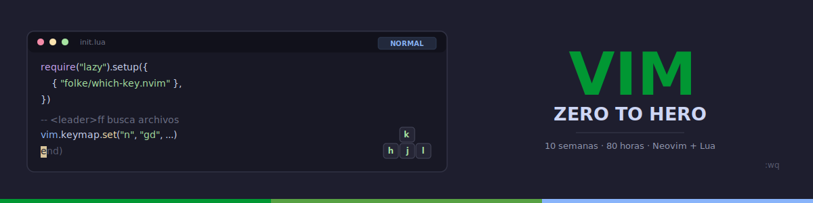

[](LICENSE)
[](#)
[](#)
[](#)
[](#)

[](README_EN.md)

---

## 📋 Descripción

Bootcamp intensivo de **10 semanas (~2.5 meses)** enfocado en el dominio de **Vim/Neovim** como editor principal de desarrollo. Diseñado para llevar a estudiantes de cero a **usuario avanzado de Vim**, con énfasis en edición eficiente, personalización y flujos de trabajo profesionales.

### 🎯 Objetivos

Al finalizar el bootcamp, los estudiantes serán capaces de:

- ✅ Dominar los modos de Vim y la filosofía de edición modal
- ✅ Navegar y editar texto a velocidad profesional sin usar el ratón
- ✅ Aplicar motions, text objects y operadores como un lenguaje de edición
- ✅ Gestionar buffers, ventanas y pestañas eficientemente
- ✅ Usar registros y macros para automatizar tareas repetitivas
- ✅ Instalar y configurar plugins esenciales con lazy.nvim
- ✅ Escribir configuración en Lua para Neovim
- ✅ Convertir Vim/Neovim en un IDE completo (LSP, Treesitter, DAP)
- ✅ Optimizar flujos de trabajo multiarchivo con quickfix, arglist y sesiones
- ✅ Construir una configuración personalizada desde cero

### 🚀 ¿Por qué Vim?

> **Vim es un lenguaje para editar texto** — No es solo un editor, es una forma de pensar la edición.

Vim lleva más de 30 años siendo el editor más eficiente para desarrolladores. Su modelo de edición modal permite manipular texto a la velocidad del pensamiento. Este bootcamp se enfoca en Vim/Neovim moderno con configuración en Lua, LSP nativo y el ecosistema actual de plugins.

---

## 🗓️ Estructura del Bootcamp

| Etapa | Semanas | Horas | Temas Principales |
|-------|---------|-------|-------------------|
| **Fundamentos** | 1-3 | 24h | Modos, movimiento, edición básica, text objects, operadores |
| **Intermedio** | 4-6 | 24h | Buffers/ventanas, registros, macros, plugins |
| **Avanzado** | 7-9 | 24h | Vimscript/Lua, LSP, Treesitter, flujos multiarchivo |
| **Producción** | 10 | 8h | Proyecto final: construye tu IDE personalizado |

**Total: 10 semanas** | **80 horas** de formación intensiva

---

## 📚 Contenido por Semana

Cada semana incluye:

```
bootcamp/week-XX-tema_principal/
├── README.md                 # Descripción y objetivos
├── rubrica-evaluacion.md     # Criterios de evaluación
├── 0-assets/                 # Imágenes y diagramas
├── 1-teoria/                 # Material teórico
├── 2-practicas/              # Ejercicios guiados
├── 3-proyecto/               # Proyecto semanal
├── 4-recursos/               # Recursos adicionales
│   ├── ebooks-free/
│   ├── videografia/
│   └── webgrafia/
└── 5-glosario/               # Términos clave
```

### 🔑 Componentes Clave

- 📖 **Teoría**: Conceptos fundamentales con ejemplos prácticos
- 💻 **Práctica**: Ejercicios progresivos en vivo dentro de Vim
- 📝 **Evaluación**: Evidencias de conocimiento, desempeño y producto
- 🎓 **Recursos**: Glosarios, referencias y material complementario

---

## 🛠️ Stack Tecnológico

| Tecnología | Versión | Uso |
|------------|---------|-----|
| Neovim | **0.10+** | Editor principal (recomendado) |
| Vim | **9.1+** | Alternativa compatible |
| Lua | **5.1 (LuaJIT)** | Lenguaje de configuración |
| lazy.nvim | **latest** | Gestor de plugins |
| Mason | **latest** | Gestor de LSP/linters/formatters |
| Git | **2.40+** | Control de versiones |

**Entorno de desarrollo**: Neovim instalado localmente + Git

---

## 🚀 Inicio Rápido

### Prerrequisitos

- **Neovim 0.10+** o **Vim 9.1+** instalado
- **Git** para control de versiones
- Terminal moderna con soporte true color (Kitty, Alacritty, WezTerm, Windows Terminal)
- Nerd Font instalada (para iconos en plugins)

### 1. Clonar el Repositorio

```bash
git clone https://github.com/ergrato-dev/bc-vim.git
cd bc-vim
```

### 2. Abrir en Neovim

```bash
nvim .
```

### 3. Navegar a la Semana Actual

```bash
cd bootcamp/week-01-fundamentos_vim
```

### 4. Seguir las Instrucciones

Cada semana contiene un `README.md` con instrucciones detalladas.

---

## 📊 Metodología de Aprendizaje

### Estrategias Didácticas

- 🎯 **Aprendizaje Basado en Proyectos (ABP)**
- 🧩 **Práctica Deliberada** con VimGolf y ejercicios de repetición
- 🔄 **Code Katas**: ejercicios de edición cronometrados
- 👥 **Code Review**: compartir configuraciones y flujos
- 🎮 **Vim Adventures**: gamificación del aprendizaje

### Distribución del Tiempo (8h/semana)

- **Teoría**: 2 horas
- **Prácticas**: 3 horas
- **Proyecto**: 3 horas

### Evaluación

Cada semana incluye tres tipos de evidencias:

1. **Conocimiento 🧠** (30%): Cuestionarios sobre comandos y conceptos
2. **Desempeño 💪** (40%): Ejercicios prácticos de edición (VimGolf)
3. **Producto 📦** (30%): Entregables (configuraciones, dotfiles, scripts)

**Criterio de aprobación**: Mínimo 70% en cada tipo de evidencia

---

## ✍️ Ejemplo: El Lenguaje Vim

En Vim, editar texto es como hablar un lenguaje:

```vim
" Eliminar una palabra:      dw   (delete word)
" Cambiar dentro de comillas: ci"  (change inside ")
" Eliminar hasta la coma:    dt,  (delete till ,)
" Copiar este párrafo:       yip  (yank inside paragraph)
" Pegar abajo:                p    (paste)
```

**Verbo + Sustantivo = Acción**. Una vez que interiorizas este lenguaje, editar texto se vuelve instintivo.

---

## 📞 Soporte

- 💬 **Discussions**: [GitHub Discussions](https://github.com/ergrato-dev/bc-vim/discussions)
- 🐛 **Issues**: [GitHub Issues](https://github.com/ergrato-dev/bc-vim/issues)

---

## ⚠️ Exención de Responsabilidad

Este repositorio es un recurso **educativo** creado con fines de aprendizaje. Al utilizarlo, aceptas los siguientes términos:

- **Solo fines educativos**: El contenido, los ejemplos de código y los proyectos están diseñados exclusivamente para la enseñanza y el aprendizaje.
- **Sin garantías**: El material se proporciona **"tal cual"**, sin garantías de ningún tipo.
- **Limitación de responsabilidad**: Los autores y contribuidores no se responsabilizan por pérdidas de datos, daños directos o indirectos, interrupciones de servicio ni cualquier otro perjuicio derivado del uso de este material.
- **Responsabilidad del estudiante**: Cada estudiante es responsable de sus propias configuraciones y entornos de desarrollo.

---

## 📄 Licencia

Este proyecto está bajo la licencia **[CC BY-NC-SA 4.0](https://creativecommons.org/licenses/by-nc-sa/4.0/)** (Creative Commons Attribution-NonCommercial-ShareAlike 4.0 International).

**Puedes:** compartir y adaptar el material, incluso crear forks educativos.
**No puedes:** usar este material con fines comerciales.
**Debes:** dar crédito apropiado y distribuir las adaptaciones bajo la misma licencia.

Ver el archivo [LICENSE](LICENSE) para el texto completo.

---

## 🏆 Agradecimientos

- [Bram Moolenaar](https://vim.org) — Por crear Vim
- [Neovim Team](https://neovim.io) — Por llevar Vim al futuro
- [TJ DeVries](https://github.com/tjdevries) — Por kickstart.nvim y su contribución a la comunidad
- [Folke Lemaitre](https://github.com/folke) — Por lazy.nvim y el ecosistema moderno
- [ThePrimeagen](https://github.com/ThePrimeagen) — Por inspirar a una generación de vimmers
- [VimTricks](https://vimtricks.com) — Por tips diarios
- [VimGolf](https://www.vimgolf.com) — Por desafíos de edición

---

## 📚 Documentación Adicional

- [🤖 Instrucciones de Copilot](.github/copilot-instructions.md)
- [📜 Código de Conducta](CODE_OF_CONDUCT.md)
- [🔒 Política de Seguridad](SECURITY.md)

---

**🎓 Bootcamp Vim — Zero to Hero**
*De cero a maestro de Vim en 10 semanas*

[Comenzar Semana 1](bootcamp/week-01-fundamentos_vim) • [Ver Documentación](docs) • [Reportar Issue](https://github.com/ergrato-dev/bc-vim/issues)

Hecho con ❤️ para la comunidad de desarrolladores
