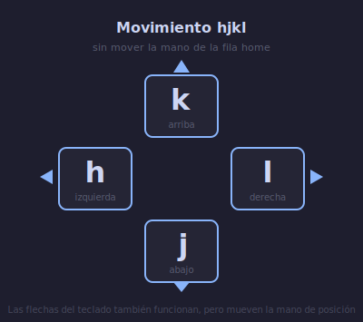
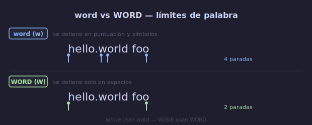
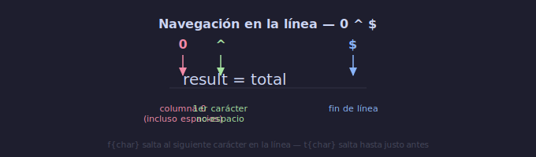

# 🏃 Movimiento Básico

## 🎯 Objetivos

- Dominar el movimiento con hjkl sin usar las flechas
- Navegar por palabras con w, b, e
- Moverse por la línea con 0, $, ^
- Saltar en el archivo con gg, G, :n
- Buscar caracteres en la línea actual con f y t

---

## 📋 Contenido

### 1. hjkl: Las Flechas de Vim



**¿Por qué hjkl y no las flechas?** Porque en el teclado original de Bill Joy (ADM-3A), las flechas estaban impresas en esas teclas. La tradición se mantuvo y resultó ser más ergonómica: no tienes que mover la mano de la fila home.

```text
Fila home del teclado:

    ┌───┬───┬───┬───┐
    │ j │ k │ l │ ; │   ← dedos descansan aquí
    └───┴───┴───┴───┘
      ↓   ↑   →


              ↑
              k
      ← h     │     l →
              │
              j
              ↓
```

| Tecla | Movimiento | Nemotecnia |
|-------|-----------|------------|
| `h` | Izquierda | **h** está a la izquierda de l |
| `j` | Abajo | **j** parece una flecha hacia abajo |
| `k` | Arriba | **k** está arriba de j |
| `l` | Derecha | **l** está a la derecha |

**Ejercicio mental**: Mueve el cursor en círculos: `hjklhjklhjkl` hasta que sea automático.

---

### 2. Movimiento por Palabras



Las "palabras" en Vim tienen dos definiciones:

| Tipo | Significado | Comandos |
|------|-------------|----------|
| **word** | Secuencia de letras, dígitos y guiones bajos | `w`, `b`, `e` |
| **WORD** | Secuencia de caracteres no-espacio | `W`, `B`, `E` |

```text
Diferencia entre word y WORD:

    foo-bar.baz(qux)
    ↑   ↑   ↑   ↑    ← w (word): se detiene en puntuación
    ↑               ↑  ← W (WORD): solo se detiene en espacios
```

| Comando | Acción |
|---------|--------|
| `w` | Siguiente inicio de palabra (**w**ord) |
| `b` | Anterior inicio de palabra (**b**ack) |
| `e` | Siguiente fin de palabra (**e**nd) |
| `W` | Siguiente inicio de WORD |
| `B` | Anterior inicio de WORD |
| `E` | Siguiente fin de WORD |

```text
Ejemplo con w, b, e en "Hola mundo cruel":

w → Hola |mundo cruel     (inicio de "mundo")
w → Hola mundo |cruel     (inicio de "cruel")
b → Hola |mundo cruel     (vuelve a "mundo")
e → Hola mund|o cruel     (fin de "mundo")
e → Hola mundo crue|l     (fin de "cruel")
```

**Regla práctica**: Usa `w`/`b` el 90% del tiempo. `e` para posicionarte al final de una palabra.

---

### 3. Movimiento en la Línea



| Comando | Acción | Nemotecnia |
|---------|--------|------------|
| `0` | Inicio de la línea (columna 0) | **0** es el principio |
| `^` | Primer carácter no-espacio de la línea | Como regex: ^ significa inicio |
| `$` | Final de la línea | Como regex: $ significa final |
| `f{char}` | Siguiente ocurrencia de {char} | **f**ind |
| `t{char}` | Hasta antes de la siguiente ocurrencia de {char} | Un**t**il |
| `;` | Repetir último f/t hacia adelante | |
| `,` | Repetir último f/t hacia atrás | |

```text
Ejemplo con la línea: "Hola mundo cruel"

0  → |Hola mundo cruel      (columna 0)
^  → |Hola mundo cruel      (primer carácter no-espacio)
$  → Hola mundo cruel|      (final de línea)
fm → Hola |mundo cruel      (find 'm')
;  → Hola mundo cruel|?      (siguiente 'm' — no hay, se queda)
```

**Los comandos f y t son superpoderes**. Aprenderlos bien esta semana te ahorrará cientos de pulsaciones.

```text
Caso real con código Python:

result = calculate_total(user_input, config)

Para cambiar "user_input" por "data":
0fm    → result = calculate_total(|user_input, config)
cwdata → result = calculate_total(data|, config)
Esc
```

---

### 4. Movimiento en el Archivo

| Comando | Acción |
|---------|--------|
| `gg` | Ir al inicio del archivo |
| `G` | Ir al final del archivo |
| `:{n}` o `{n}G` | Ir a la línea {n} |
| `{` | Párrafo anterior (línea vacía) |
| `}` | Párrafo siguiente |

```text
gg  → |primera línea
G   → última línea|
:50 → línea 50
50G → línea 50 (alternativa)
```

---

### 5. Scrolling (Desplazamiento)

| Comando | Acción |
|---------|--------|
| `Ctrl-u` | Media pantalla arriba (**u**p) |
| `Ctrl-d` | Media pantalla abajo (**d**own) |
| `Ctrl-f` | Pantalla completa adelante (**f**orward) |
| `Ctrl-b` | Pantalla completa atrás (**b**ackward) |
| `zz` | Centrar pantalla en la línea actual |
| `zt` | Llevar línea actual al tope |
| `zb` | Llevar línea actual al fondo |

```text
Ctrl-d y Ctrl-u son los más útiles para lectura de código.
No uses PageUp/PageDown — mantén las manos en posición.
```

---

### 6. Búsqueda Simple

| Comando | Acción |
|---------|--------|
| `/patrón` | Buscar patrón hacia adelante |
| `?patrón` | Buscar patrón hacia atrás |
| `n` | Siguiente resultado (**n**ext) |
| `N` | Resultado anterior |

```text
/función   → busca "función" hacia adelante
n          → siguiente coincidencia
n          → siguiente
N          → anterior
```

**El resaltado de búsqueda** se activa con `:set hlsearch`. Por defecto puede estar activado en tu distribución. Se limpia con `:noh` (**n**o **h**ighlight).

---

## 💡 Resumen de Movimiento

| Categoría | Comandos Clave |
|-----------|---------------|
| Básico | `h` `j` `k` `l` |
| Palabras | `w` `b` `e` |
| Línea | `0` `$` `^` |
| Búsqueda en línea | `f{char}` `t{char}` `;` `,` |
| Archivo | `gg` `G` `:{n}` |
| Scroll | `Ctrl-u` `Ctrl-d` `zz` |
| Búsqueda | `/patrón` `n` `N` |

---

## ✅ Checklist de Verificación

- [ ] Moverme 50 líneas abajo y arriba sin mirar hjkl
- [ ] Navegar palabras con w, b sin pensar
- [ ] Ir al inicio (0) y final ($) de línea automáticamente
- [ ] Usar f{char} para saltar a un carácter específico en la línea
- [ ] Ir al inicio (gg) y final (G) del archivo
- [ ] Buscar texto con / y navegar resultados con n/N
- [ ] NO usar las flechas del teclado en absoluto

---

## 🎮 Ejercicio Rápido

```text
Abre cualquier archivo de texto y practica esta secuencia 10 veces:

1. gg        → inicio del archivo
2. 5j        → 5 líneas abajo
3. w w w     → 3 palabras adelante
4. f.        → salta al siguiente punto
5. G         → final del archivo
6. Ctrl-u    → media pantalla arriba
7. $         → final de línea
8. 0         → inicio de línea

Repite hasta que sea fluido.
```

---

## ➡️ Siguiente

[04 - Edición Básica](04-edicion-basica.md)
