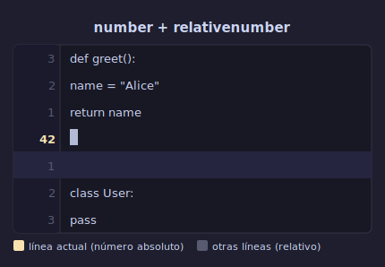

# ⚙️ Configuración Inicial

## 🎯 Objetivos

- Crear tu primer archivo de configuración para Neovim (init.lua)
- Configurar opciones básicas que mejoran la experiencia inmediata
- Crear mappings personalizados (atajos de teclado)
- Entender la estructura de directorios de configuración

---

## 📋 Contenido

### 1. ¿Dónde se guarda la configuración?

#### Neovim (recomendado para este bootcamp)

```text
~/.config/nvim/
├── init.lua              ← Punto de entrada de la configuración
├── lua/                  ← Módulos Lua (semanas futuras)
│   ├── core/             ← Configuración base
│   └── plugins/          ← Plugins (semana 6)
└── after/                ← Configuraciones que se cargan al final
    └── ftplugin/         ← Config por tipo de archivo
```

#### Vim clásico

```text
~/.vimrc                  ← Único archivo de configuración
~/.vim/                   ← Directorio para plugins y config adicional
```

---

### 2. Tu Primer init.lua

Crea el archivo `~/.config/nvim/init.lua` y copia esta configuración base:

```lua
-- Opciones generales
vim.opt.number = true             -- Mostrar números de línea absolutos
vim.opt.relativenumber = true     -- Mostrar números relativos (mejor para movimiento)
vim.opt.mouse = "a"               -- Permitir uso del mouse (útil para principiantes)
vim.opt.ignorecase = true         -- Ignorar mayúsculas en búsquedas
vim.opt.smartcase = true          -- Case-sensitive si pones mayúscula
vim.opt.hlsearch = true           -- Resaltar resultados de búsqueda
vim.opt.incsearch = true          -- Búsqueda incremental
vim.opt.termguicolors = true      -- Colores true color (24-bit)
vim.opt.signcolumn = "yes"        -- Mostrar columna de signos (git gutter, etc.)
vim.opt.scrolloff = 8             -- Mantener 8 líneas de contexto al hacer scroll

-- Tabulación: 4 espacios
vim.opt.tabstop = 4               -- Ancho visual de un tab
vim.opt.softtabstop = 4           -- Ancho de tab en Insert mode
vim.opt.shiftwidth = 4            -- Ancho de indentación (>>, <<)
vim.opt.expandtab = true          -- Convertir tabs en espacios
vim.opt.smartindent = true        -- Indentación automática inteligente

-- Apariencia
vim.opt.cursorline = true         -- Resaltar línea actual
vim.opt.background = "dark"       -- Fondo oscuro
vim.opt.wrap = false              -- No cortar líneas largas (mejor para código)

-- Dividir ventanas
vim.opt.splitbelow = true         -- Split horizontal abajo
vim.opt.splitright = true         -- Split vertical derecha

-- Tiempo de espera para combos de teclas
vim.opt.timeoutlen = 300          -- ms de espera para secuencias de teclas
vim.opt.updatetime = 250          -- ms para escribir swap file

-- Undo persistente (guarda undo entre sesiones)
vim.opt.undofile = true           -- Guardar historial de undo en archivo
```

---

### 3. Explicación de las Opciones Más Importantes

#### `number` + `relativenumber`



```text
Con number + relativenumber:
  3  function hello() {
  2    console.log("hola")
  1    │  ← cursor aquí, línea absoluta
1    return true
2  }

El número relativo te dice cuántas líneas saltar con 3j, 2k, etc.
Sin relativenumber tendrías que contar manualmente.
```

#### `expandtab` + `tabstop` + `shiftwidth`

```text
expandtab = true → los tabs se convierten en espacios
shiftwidth = 4  → >> agrega 4 espacios, << quita 4
tabstop = 4     → un tab se ve como 4 espacios

Configuración típica: todos en 2 o todos en 4.
Python: PEP 8 recomienda 4 espacios.
JavaScript/TypeScript: comúnmente 2 espacios.
```

#### `scrolloff`

```text
scrolloff = 8 mantiene 8 líneas de contexto al hacer scroll.

Sin scrolloff (0):
cursor llega al borde → la vista salta bruscamente

Con scrolloff (8):
cursor a 8 líneas del borde → la vista hace scroll suave
```

---

### 4. Mappings Básicos (Atajos de Teclado)

Los mappings te permiten crear tus propios atajos. Se definen con `vim.keymap.set()`.

#### Leader Key

La **leader key** es una tecla prefijo para tus mappings personalizados. Por defecto es `\`, pero la mayoría la cambia a `<space>`.

```lua
-- Define la leader key como barra espaciadora
vim.g.mapleader = " "
vim.g.maplocalleader = " "
```

Ahora `<leader>w` significa "presiona espacio, luego w".

#### Mappings Esenciales

```lua
-- Guardar y salir más rápido
vim.keymap.set("n", "<leader>w", "<cmd>w<CR>", { desc = "Guardar archivo" })
vim.keymap.set("n", "<leader>q", "<cmd>q<CR>", { desc = "Salir" })
vim.keymap.set("n", "<leader>x", "<cmd>x<CR>", { desc = "Guardar y salir" })

-- Esc más rápido desde Insert mode
vim.keymap.set("i", "jk", "<Esc>", { desc = "Salir de Insert mode" })
vim.keymap.set("i", "jj", "<Esc>", { desc = "Salir de Insert mode" })

-- Limpiar resaltado de búsqueda
vim.keymap.set("n", "<leader>h", "<cmd>noh<CR>", { desc = "Limpiar highlight de búsqueda" })

-- Navegación entre splits (preparación para Semana 4)
vim.keymap.set("n", "<C-h>", "<C-w>h", { desc = "Ir a split izquierdo" })
vim.keymap.set("n", "<C-j>", "<C-w>j", { desc = "Ir a split inferior" })
vim.keymap.set("n", "<C-k>", "<C-w>k", { desc = "Ir a split superior" })
vim.keymap.set("n", "<C-l>", "<C-w>l", { desc = "Ir a split derecho" })

-- Mantener selección al indentar
vim.keymap.set("v", "<", "<gv", { desc = "Indentar izquierda (mantener selección)" })
vim.keymap.set("v", ">", ">gv", { desc = "Indentar derecha (mantener selección)" })
```

#### Cómo Leer un Mapping

```lua
vim.keymap.set({modo}, {teclas}, {acción}, {opciones})
--               ↑       ↑         ↑         ↑
--               n       <leader>w :w<CR>    descripción
--          normal mode  espacio+w guardar   para which-key
```

| Modo | Significado |
|------|-------------|
| `n` | Normal mode |
| `i` | Insert mode |
| `v` | Visual mode (carácter) |
| `x` | Visual mode (todas) |
| `t` | Terminal mode |

---

### 5. Recargar la Configuración

Cuando modificas tu `init.lua`, necesitas recargarlo. Formas de hacerlo:

```text
Forma 1: Cerrar y abrir Neovim (la más simple)
Forma 2: :source ~/.config/nvim/init.lua (dentro de Neovim)
Forma 3: :luafile ~/.config/nvim/init.lua (para archivos Lua)
Forma 4: Crear un mapping para recargar:
         vim.keymap.set("n", "<leader>sv", "<cmd>source ~/.config/nvim/init.lua<CR>",
           { desc = "Recargar configuración" })
```

---

### 6. Estructura Completa (Visión a Futuro)

Así evolucionará tu configuración durante el bootcamp:

```text
~/.config/nvim/
├── init.lua                  ← Semana 1: opciones básicas
├── lua/
│   ├── core/
│   │   ├── options.lua       ← Semana 7: modularizamos
│   │   ├── keymaps.lua       ← Semana 7: mappings separados
│   │   └── autocmds.lua      ← Semana 7: autocomandos
│   └── plugins/
│       ├── init.lua          ← Semana 6: lazy.nvim bootstrap
│       ├── ui.lua            ← Semana 6: plugins de interfaz
│       ├── editing.lua       ← Semana 6: plugins de edición
│       ├── lsp.lua           ← Semana 8: language servers
│       └── dap.lua           ← Semana 8: debugging
└── after/
    └── ftplugin/             ← Semana 7: config por lenguaje
```

No te preocupes por esto ahora. Lo construiremos paso a paso.

---

## ✅ Checklist de Verificación

- [ ] init.lua creado en `~/.config/nvim/init.lua`
- [ ] `number` + `relativenumber` funcionando (verifica con :set number?)
- [ ] Tabulación de 4 espacios configurada
- [ ] Leader key mapeada a `<space>`
- [ ] `jk`/`jj` mapeado para salir de Insert mode
- [ ] La configuración se carga sin errores al abrir Neovim
- [ ] Entiendo qué hace cada opción de mi configuración

---

## 💡 Próximos Pasos

Con esto completas la teoría de la Semana 1. Ahora:

1. **Práctica**: Completa los ejercicios en `2-practicas/`
2. **Proyecto**: Implementa tu init.lua personalizado en `3-proyecto/`
3. **Vocabulario**: Revisa el glosario en `5-glosario/`

---

[📖 Volver al README de la Semana](../README.md) • [💻 Ir a Prácticas](../2-practicas/README.md)
