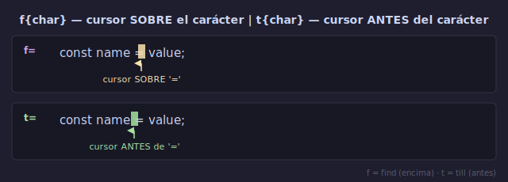

# 🔍 f y t: Búsqueda en Línea

## 🎯 Objetivos

- Dominar `f{char}` y `t{char}` para saltos precisos en la línea actual
- Usar `F{char}` y `T{char}` para búsqueda hacia atrás
- Repetir búsquedas con `;` y `,`
- Combinar f/t con operadores para ediciones quirúrgicas en una línea

---

## 📋 Contenido

### 1. ¿Por qué f y t?

En la Semana 1 aprendiste `w`, `b`, `e`, `0`, `$` para moverte en una línea. Son buenos, pero imprecisos:

```text
result = calculate_total(user_input, config)
                            ↑
```

Para llegar al guion bajo de `user_input`:
- Con `w`: 3 saltos (result → = → calculate_total( → user_input), corres riesgo de pasarte
- Con `f_`: 2 teclas, precisión absoluta

**f y t son cirugía. w/b/e son transporte público.**

---

### 2. f{char}: Find



Salta el cursor **sobre** la siguiente ocurrencia de `{char}` en la línea actual.

```text
Sintaxis: f{char}

Línea: "Hola mundo cruel"
Cursor en 'H':
- f m  → Hola |mundo cruel   (salta a la 'm')
- f u  → Hola m|undo cruel   (desde 'm', salta a 'u')
- f c  → Hola mundo |cruel   (salta a 'c')
- f z  → no pasa nada (sin coincidencia)
```

**Regla**: Si no encuentra `{char}`, el cursor no se mueve. No hay error, simplemente se queda donde está.

---

### 3. F{char}: Find hacia atrás

Igual que `f` pero busca hacia la **izquierda** del cursor.

```text
Línea: "Hola mundo cruel"
Cursor en 'c' (cruel):
- F m  → Hola |mundo cruel   (retrocede a 'm')
- F H  → |Hola mundo cruel   (retrocede al inicio)
```

---

### 4. t{char}: Till (hasta antes de)

Salta el cursor **hasta justo antes** de la siguiente ocurrencia de `{char}`.

```text
Línea: "Hola mundo cruel"
Cursor en 'H':
- t m  → Hola| mundo cruel   (justo antes de 'm')
- t o  → Hol|a mundo cruel   (justo antes de 'o')
```

**Diferencia f vs t**:
```text
Línea: "const name = value;"

Con f =:  const name |= value;    (cursor SOBRE el =)
Con t =:  const name| = value;    (cursor ANTES del =)

¿Cuándo usar cada uno?
- f: quieres operar DESDE ese carácter (ej: d f ; → elimina hasta ;)
- t: quieres operar HASTA antes de ese carácter (ej: d t ; → elimina hasta antes de ;)
```

---

### 5. T{char}: Till hacia atrás

Igual que `t` pero busca hacia la izquierda.

```text
Línea: "Hola mundo cruel"
Cursor en 'c' (cruel):
- T o  → Hola mund|o cruel   (hasta después de 'o' hacia atrás)
```

---

### 6. ; y ,: Repetir Búsqueda

El superpoder de f y t: puedes repetir la última búsqueda sin volver a escribir el carácter.

| Comando | Acción |
|---------|--------|
| `;` | Repite el último `f`/`t`/`F`/`T` **hacia adelante** |
| `,` | Repite el último `f`/`t`/`F`/`T` **hacia atrás** |

```text
Línea: "a-b-c-d-e-f-g"

f- → a|-b-c-d-e-f-g     (primer guion)
;  → a-b|-c-d-e-f-g     (segundo guion)
;  → a-b-c|-d-e-f-g     (tercer guion)
;  → a-b-c-d|-e-f-g     (cuarto)
,  → a-b-c|-d-e-f-g     (vuelve al tercero)
,  → a-b|-c-d-e-f-g     (vuelve al segundo)
```

**Caso real con código**:
```javascript
const user = { name: "Ana", age: 30, city: "Madrid" }
//                                ↑ objetivo: cambiar 'a' de "age"

F"     → const user = { name: |"Ana", age: 30, city: "Madrid" }
;      → const user = { name: "Ana", age: 30, city: |"Madrid" }
;      → siguiente " — no hay, se queda
,      → const user = { name: "Ana", age: 30, city: |"Madrid" } (no se movió)
```

**Memoriza**: `;` = siguiente, `,` = anterior. Como en las listas de argumentos.

---

### 7. Combinar f/t con Operadores

Aquí es donde f y t se vuelven letales:

```text
d f {char}  → delete hasta {char} INCLUSIVE
d t {char}  → delete hasta ANTES de {char}
c f {char}  → change hasta {char} INCLUSIVE
c t {char}  → change hasta ANTES de {char}
y f {char}  → yank hasta {char} INCLUSIVE
y t {char}  → yank hasta ANTES de {char}
v f {char}  → seleccionar hasta {char} INCLUSIVE
v t {char}  → seleccionar hasta ANTES de {char}
```

```text
Ejemplo: "const name = 'John Doe';"
                        ↑ cursor en 'J'

ct'   → const name = '|';          (cambia contenido de comillas)
       Escribes: Jane → Esc
       → const name = 'Jane';

df;   → const name = 'John Doe'    (elimina ; y espacio antes)
       (el ; se fue también)
```

**Caso práctico — corregir un parámetro**:
```javascript
function greet(name, age, city) {
//                     ↑ cursor en coma después de name

ct)   → function greet(name|) {     (elimina age, city)
        Escribes: message) → Esc
        → function greet(name, message) {
```

---

### 8. Resumen Visual

```text
Comandos de búsqueda en línea:

  HACIA ADELANTE:                    HACIA ATRÁS:
  ┌─────────────────┐                ┌─────────────────┐
  │ f{char}  find   │ ← sobre →     │ F{char}  find   │
  │ t{char}  till   │ ← antes →     │ T{char}  till   │
  └─────────────────┘                └─────────────────┘

  Repetición:
  ┌──────────────┐
  │ ;  siguiente │
  │ ,  anterior  │
  └──────────────┘

Regla nemotécnica:
- f = Find (encuentra)
- t = unTil (hasta)
- MAYÚSCULA = hacía atrás (como shift = retroceso)
```

---

## 💡 Consejos

> 🎯 **f y t son tus nuevos mejores amigos.** Después de hjkl y w/b, son los comandos de movimiento que más usarás.

> 🔁 **Practica ; y ,** La repetición es lo que convierte f/t de "útil" a "superpoder". Sin `;` y `,`, cada salto requiere volver a escribir el carácter.

> ⚡ **Combínalos con operadores YA.** No esperes: `df:`, `ct)`, `yf;`. Cuanto antes los incorpores a tu edición diaria, más rápido te beneficiarás.

> 🚫 **No abuses de f/t para búsquedas largas.** Si el carácter está a más de 3-4 ocurrencias, considera `/` o `?` (lo veremos en la siguiente lección).

---

## ✅ Checklist de Verificación

- [ ] Uso `f{char}` para saltar a un carácter específico en la línea
- [ ] Uso `t{char}` cuando quiero posicionarme ANTES de un carácter
- [ ] Entiendo la diferencia entre `f` y `t` (sobre vs antes)
- [ ] Uso `F` y `T` para buscar hacia atrás
- [ ] Uso `;` y `,` para repetir búsquedas sin reescribir el carácter
- [ ] Combino `d`/`c`/`y` con `f`/`t`: `df:`, `ct)`, `yf;`

---

## 🎮 Ejercicio Rápido

Abre cualquier archivo de código y practica:

```text
1. f= → salta al primer =
2. ;  → siguiente =
3. ;  → siguiente =
4. ,  → anterior =
5. F= → busca = hacia atrás
6. t; → hasta antes del siguiente ;
7. df; → elimina hasta el siguiente ; (inclusive)
8. u  → deshacer
9. ct) → cambia hasta antes del siguiente )
10. Esc → vuelve a Normal

Repite con diferentes caracteres: ., (, ), {, }, :, comillas.
```

---

## ➡️ Siguiente

[02 - Búsqueda en Archivo](02-busqueda-en-archivo.md)
