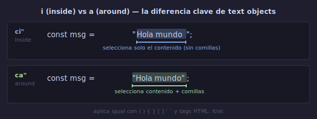

# 🧱 Text Objects

## 🎯 Objetivos

- Entender qué son los text objects y por qué son revolucionarios
- Dominar el paradigma `i` (inside) vs `a` (around)
- Conocer todos los text objects esenciales: palabras, comillas, paréntesis, tags
- Memorizar la tabla completa de text objects y sus combinaciones

---

## 📋 Contenido

### 1. ¿Qué es un Text Object?

Un **text object** es una unidad estructural de texto que Vim reconoce semánticamente. No es "N caracteres" ni "desde aquí hasta allá". Es "la palabra", "el contenido entre paréntesis", "el string entre comillas".

```text
Editores tradicionales:
→ seleccionas con ratón, cortas, pegas

Vim con text objects:
→ ci" = cambia el contenido de las comillas
→ 3 teclas. Sin seleccionar, sin ratón.
```

**El paradigma**: No pienses en posiciones. Piensa en estructuras.

---

### 2. Inside (`i`) vs Around (`a`)



Todos los text objects tienen dos variantes:

| Prefijo | Significado | Incluye |
|---------|-------------|---------|
| `i` | **inside** (dentro) | Solo el contenido, sin delimitadores ni espacios |
| `a` | **around** (alrededor) | Contenido + delimitadores + espacio en blanco asociado |

```text
Texto:  "Hola mundo"

Cursor en cualquier parte dentro de las comillas:

ci" → cambia 'Hola mundo' (dentro de comillas)
      Resultado: "|"

ca" → cambia "Hola mundo" (comillas incluidas)
      Resultado: |

di" → elimina 'Hola mundo'
      Resultado: ""

da" → elimina "Hola mundo"
      Resultado: |
```

**Regla**: `i` = solo el interior. `a` = incluye los bordes.

---

### 3. Text Objects de Palabra

| Text Object | Significado | Ejemplo con "foo bar" |
|-------------|-------------|------------------------|
| `iw` | Inner word | Palabra sin espacios |
| `aw` | A word | Palabra + espacio(s) |
| `iW` | Inner WORD | WORD (no-espacio) sin espacios |
| `aW` | A WORD | WORD + espacio(s) |

```text
Diferencia entre word y WORD:
  foo.bar(baz)
  ↑↑↑ ↑↑↑ ↑↑↑   ← w (word): separa en puntuación
  ↑↑↑↑↑↑↑↑↑↑↑   ← W (WORD): solo separa en espacios

Ejemplo:  "foo.bar"
Cursor en 'o' de foo:

diw → ".bar"        (elimina 'foo', punto y bar quedan)
daw → "bar"         (elimina 'foo.' — palabra + punto)
diW → ""            (elimina 'foo.bar' completo)
```

**Cuándo usar iw vs aw**:
- `ciw`: cambiar una palabra manteniendo espaciado (ej: renombrar variable)
- `daw`: eliminar una palabra y su espacio (para no dejar doble espacio)

---

### 4. Text Objects de Delimitadores

| Text Object | Delimitador | Alternativas |
|-------------|-------------|--------------|
| `i)` o `i(` | Paréntesis | `ib` (inner block) |
| `a)` o `a(` | Paréntesis + espacios | `ab` (a block) |
| `i}` o `i{` | Llaves | `iB` (inner Block) |
| `a}` o `a{` | Llaves + espacios | `aB` (a Block) |
| `i]` o `i[` | Corchetes | |
| `a]` o `a[` | Corchetes + espacios | |
| `i>` o `i<` | Ángulos | |
| `a>` o `a<` | Ángulos + espacios | |
| `i"` | Comillas dobles | |
| `a"` | Comillas dobles + comillas | |
| `i'` | Comillas simples | |
| `a'` | Comillas simples + comillas | |
| `` i` `` | Backticks | |
| `` a` `` | Backticks + backticks | |

```text
Ejemplos con paréntesis:

Texto:  calcular(1, 2, 3)

ci( → calcular(|)          cambia el interior
ci) → calcular(|)          mismo resultado
cib → calcular(|)          'b' = block

ca( → calcular|            elimina contenido + paréntesis
da( → calcular|            elimina contenido + paréntesis

Texto:  { "nombre": "Ana" }

di{ → {|}                  elimina contenido de llaves
da{ → |                    elimina llaves + contenido
```

**Regla nemotécnica**:
- `i(` = `i)` = `ib` (paréntesis: inner block)
- `i{` = `i}` = `iB` (llaves: inner Block, B mayúscula)
- Los corchetes y ángulos solo tienen su propia notación: `i[`, `i<`

---

### 5. Text Objects de Tags (HTML/XML)

| Text Object | Significado |
|-------------|-------------|
| `it` | Inner tag (contenido del tag, sin los tags) |
| `at` | A tag (contenido + tags) |

```html
<div class="container">
    <h1>Título</h1>
    <p>Contenido</p>
</div>

Cursor dentro de <p>Contenido</p>:

cit → <p>|</p>               cambia "Contenido"
dit → <p></p>                elimina el contenido
cat → |                      elimina todo <p>Contenido</p>
dat → |                      igual
```

---

### 6. Text Objects de Párrafo y Oración

| Text Object | Significado |
|-------------|-------------|
| `ip` | Inner paragraph |
| `ap` | A paragraph (incluye línea en blanco) |
| `is` | Inner sentence |
| `as` | A sentence (incluye espacio) |

```text
Párrafo en Vim = bloque de texto separado por líneas vacías.

Texto:
  Primer párrafo con varias
  líneas de contenido.
                        ← línea vacía (separador)
  Segundo párrafo aquí.

Cursor en "Primer párrafo...":

dap → elimina todo el primer párrafo (incluye la línea vacía)
      Resultado:
      Segundo párrafo aquí.

dip → elimina solo el contenido del primer párrafo
      Resultado:
                        ← línea vacía se mantiene
      Segundo párrafo aquí.
```

---

### 7. Combinar Text Objects con Operadores

Los text objects no sirven solos — necesitan un operador. Este es el paradigma completo:

```text
{operador}{i/a}{text-object}

d i w  → delete inner word
c i "  → change inside quotes
y a {  → yank around braces
> i p  → indent inner paragraph
= a {  → format around braces
gu i w → lowercase inner word
gU a w → UPPERCASE a word
```

**Tabla de combinaciones frecuentes**:

| Comando | Acción | Uso típico |
|---------|--------|------------|
| `ciw` | Cambiar palabra | Renombrar variable |
| `ci"` | Cambiar string | Editar valor |
| `di(` | Eliminar argumentos | Borrar parámetros |
| `yi{` | Copiar bloque | Duplicar objeto |
| `da{` | Eliminar bloque | Borrar función |
| `gUiw` | Mayúsculas a palabra | Constantes |
| `guiw` | Minúsculas a palabra | Normalizar texto |
| `>i{` | Indentar bloque | Formatear código |
| `=a{` | Autoformatear bloque | Arreglar indentación |

---

### 8. Text Objects en Código Real

#### Cambiar el contenido de un string

```javascript
const mensaje = "Hola Mundo";
//               ↑ cursor aquí

ci"  →  const mensaje = "|";
Escribes: "Adiós"
Esc    →  const mensaje = "Adiós";
```

#### Cambiar argumentos de una función

```python
resultado = procesar(datos_entrada, opciones_usuario)
//                   ↑ cursor dentro de los ()

ci(  →  resultado = procesar(|)
Escribes: datos_filtrados
Esc    →  resultado = procesar(datos_filtrados)
```

#### Eliminar un bloque JSON completo

```json
{
    "usuario": "ana",
    "config": {                  ← cursor en '{'
        "tema": "oscuro",
        "idioma": "es"
    }
}

da{  →  {
            "usuario": "ana",
        }
```

#### Cambiar valor de una propiedad clave-valor

```yaml
server:
    host: localhost
    port: 8080       ← cursor en '8'

ciw  →  server:
            host: localhost
            port: |
Escribes: 3000
Esc    →  server:
            host: localhost
            port: 3000
```

---

### 9. Extendiendo Text Objects (Plugins)

El ecosistema de plugins añade más text objects. Los más populares (los exploraremos en Semana 6):

| Plugin | Text Objects nuevos |
|--------|-------------------|
| vim-surround | `cs"'` cambiar comillas, `ds"` eliminar surround |
| vim-textobj-user | Framework para crear text objects custom |
| targets.vim | Mejoras a text objects existentes (next/previous) |
| nvim-treesitter-textobjects | Text objects basados en AST: `if` (inner function), `ic` (inner class) |

---

## 💡 Tabla Completa de Referencia

```text
┌─────────────────────────────────────────────────────────┐
│ TEXT OBJECTS DE VIM                                      │
├──────────┬───────────────┬──────────────────────────────┤
│ Palabras │ iw / aw       │ Palabra sin/con espacios     │
│          │ iW / aW       │ WORD sin/con espacios        │
├──────────┼───────────────┼──────────────────────────────┤
│ Comillas│ i" / a"       │ Comillas dobles              │
│          │ i' / a'       │ Comillas simples             │
│          │ i` / a`       │ Backticks                    │
├──────────┼───────────────┼──────────────────────────────┤
│ Bloques │ i( i) ib / a( a) ab │ Paréntesis          │
│          │ i{ i} iB / a{ a} aB │ Llaves              │
│          │ i[ i]    / a[ a]    │ Corchetes           │
│          │ i< i>    / a< a>    │ Ángulos             │
├──────────┼───────────────┼──────────────────────────────┤
│ Tags    │ it / at       │ Tags HTML/XML                │
├──────────┼───────────────┼──────────────────────────────┤
│ Texto   │ ip / ap       │ Párrafo                     │
│          │ is / as       │ Oración                     │
├──────────┼───────────────┼──────────────────────────────┤
│ i = inside (solo contenido)                             │
│ a = around (contenido + delimitadores + espacios)       │
└─────────────────────────────────────────────────────────┘
```

---

## ✅ Checklist de Verificación

- [ ] Entiendo el paradigma `i` (inside) vs `a` (around)
- [ ] Uso `ciw` y `diw` para manipular palabras
- [ ] Uso `ci"`, `ci'`, `` ci` `` para cambiar strings
- [ ] Uso `ci(`, `di{`, `ya[` para manipular bloques
- [ ] Diferencio `di{` (borrar contenido) de `da{` (borrar todo)
- [ ] Uso `cit` en archivos HTML/JSX
- [ ] Combino text objects con todos los operadores: d, c, y, >, <, =, gu, gU

---

## 🎮 Ejercicio Rápido

Abre un archivo de código y practica esta secuencia 5 veces en diferentes contextos:

```text
1. Encuentra un string → ci" → escribe algo → Esc
2. Encuentra argumentos de función → ci( → escribe → Esc
3. En un objeto JSON → di{ → u (deshacer) → da{ → u
4. Encuentra una palabra → ciw → escribe → Esc
5. Encuentra un tag HTML → cit → escribe → Esc

Varía los text objects:
6. yi{ → copia todo el bloque donde estás
7. p → pega la copia
8. =i{ → formatea el bloque recién pegado
```

---

## ➡️ Siguiente

[05 - Vim como Lenguaje](05-vim-como-lenguaje.md)
