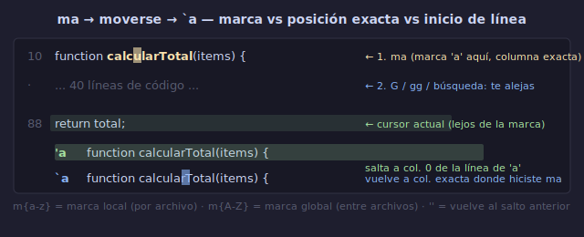

# 📍 Marcas (Marks)

## 🎯 Objetivos

- Crear marcas locales (`m{a-z}`) para navegación dentro de un archivo
- Crear marcas globales (`m{A-Z}`) para navegación entre archivos
- Saltar a marcas con `` ` `` (posición exacta) y `'` (inicio de línea)
- Usar marcas automáticas (`'`, `''`) para ir y volver saltando
- Aplicar marcas en flujos de refactorización y navegación de código

---

## 📋 Contenido

### 1. ¿Qué es una Marca?

Una **marca** (mark) es una posición guardada en un archivo. Piensa en ellas como bookmarks o favoritos del teclado.



```text
m{letra}     → crea una marca en la posición actual
`{letra}     → salta a la posición exacta (línea + columna) de la marca
'{letra}     → salta al inicio de la línea de la marca
```

```text
Ejemplo:
m a          → guarda posición actual como marca 'a'
(te mueves a cualquier parte del archivo)
` a          → vuelves a la posición exacta donde creaste 'a'
' a          → vuelves a la línea donde creaste 'a' (columna 0)
```

---

### 2. Marcas Locales (`a-z`)

Son por archivo. Cada archivo tiene su propio conjunto de marcas `a-z`.

```text
ma           → crea marca 'a' en posición actual
mb           → crea marca 'b'
mc           → crea marca 'c'
...
mz           → crea marca 'z'

`a           → salta a marca 'a' (posición exacta)
`b           → salta a marca 'b'
```

**Las marcas persisten mientras el archivo está abierto.** Si cierras el archivo, las marcas locales se pierden (a menos que tengas `vim.opt.viminfo` o `shada` configurado).

---

### 3. Marcas Globales (`A-Z`)

Son entre archivos. Puedes crear una marca en `archivo1.lua` y saltar a ella desde `archivo2.js`.

```text
mA           → crea marca global 'A' en posición actual
(abres otro archivo)
'A           → salta al archivo y línea de la marca 'A'
`A           → salta al archivo, línea y columna de la marca 'A'
```

**Las marcas globales persisten entre sesiones** (se guardan en `shada`/`viminfo`).

```text
Casos de uso:
- Marcar tu init.lua como mA para volver rápido a configurar
- Marcar una sección de TODO como mT para saltar entre tareas
- Marcar archivos frecuentes: mP para proyecto, mC para config
```

---

### 4. Marcas Automáticas (Built-in)

Vim crea marcas automáticamente sin que las definas:

| Marca | Significado |
|-------|-------------|
| `''` o ``` `` ``` | Salta a la posición anterior al último salto |
| `'.` | Última posición donde se hizo un cambio |
| `'^` | Última posición donde se salió de Insert mode |
| `'"` | Posición al salir del archivo (la última vez) |
| `'[` | Inicio del último cambio (yank, delete, change) |
| `']` | Fin del último cambio |
| `'<` | Inicio de la última selección visual |
| `'>` | Fin de la última selección visual |
| `'0` | Última posición al salir de Vim (sesión anterior) |

```text
'' (dos comillas simples) → el "deshacer" del movimiento
                            Salta entre donde estás y donde estabas.

Uso más común:
- Estas editando en línea 500
- Vas a línea 10 con :10
- Haces un cambio
- '' → vuelves a línea 500
- '' → vuelves a línea 10
```

---

### 5. Comandos para Ver y Gestionar Marcas

```text
:marks       → lista todas las marcas activas
:marks a b c → lista marcas específicas a, b, c
:delm a      → elimina la marca 'a' (delm = delete mark)
:delm a-e    → elimina marcas de 'a' a 'e'
:delm!       → elimina TODAS las marcas locales (a-z)
```

```text
Salida típica de :marks:

mark line  col file/text
 '      45   12 function calcular()
 a      10    0 inicio de main
 b     234    5 sección de errores
 c     567    0 final del archivo
 A      12    3 ~/.config/nvim/init.lua
```

---

### 6. Patrones de Uso

#### Patrón 1: Marcas para refactorización

```text
Estás refactorizando una función larga. Necesitas ir y volver
entre la definición, los usos, y las pruebas.

1. Ve a la definición → mA
2. Ve al primer uso → mB  
3. Ve a las pruebas → mC

Ahora:
'A  → definición
'B  → primer uso
'C  → pruebas
''  → vuelves a donde estabas
```

#### Patrón 2: Marcas para explorar código nuevo

```text
Abres un archivo de 2000 líneas que no conoces.

1. gg → mA          (inicio)
2. G → mZ           (final)
3. /function → mF   (primera función)
4. /export → mE     (exports)

Ahora puedes saltar entre secciones sin perderte.
```

#### Patrón 3: Marcas para editar en múltiples lugares

```text
Necesitas hacer cambios en 3 lugares diferentes del archivo:

1. Primer lugar: haces el cambio → mA
2. Segundo lugar: haces el cambio → mB
3. Tercer lugar: haces el cambio → mC

Ahora para revisar:
'A → ver primera sección
'' → volver
'B → ver segunda sección
'' → volver
```

---

### 7. Marcas con Operadores

Puedes usar marcas como rangos en comandos:

```text
d ' a        → delete desde cursor hasta línea de la marca 'a'
y ` a        → yank desde cursor hasta posición exacta de marca 'a'
c ' b        → change hasta línea de marca 'b'

:'a,'b s/foo/bar/g    → sustituye desde línea de marca 'a' hasta 'b'
:'a,. s/foo/bar/g      → sustituye desde marca 'a' hasta línea actual
```

```text
Caso real:
mA               → marca el inicio de un bloque que quieres mover
Ve al final      → posiciona cursor al final del bloque
d 'a             → delete hasta la línea de marca 'a'
Ve a destino     → nueva ubicación
p                → pega el bloque
```

---

### 8. Visual Mode con Marcas

```text
v ' a        → selecciona visualmente desde cursor hasta marca 'a'
V ' b        → selecciona líneas desde cursor hasta marca 'b'
```

---

### 9. Comparación: `'` vs `` ` ``

```text
'{marca}     → salta al INICIO de la línea de la marca
`{marca}     → salta a la posición EXACTA (línea + columna) de la marca

Ejemplo:
Marcas la palabra "calcular" en:
    function calcularTotal(items) {
           ↑ columna 13

m c           → crea marca 'c' en columna 13

' c           → salta a columna 0 de esa línea: "f" de function
` c           → salta a columna 13 exacta: "c" de calcular

¿Cuándo usar cada uno?
' → para navegación general ("llévame a esa línea")
` → para navegación precisa ("llévame a esa posición exacta")
```

---

### 10. Trucos y Buenas Prácticas

#### Usa letras nemotécnicas

```text
mA → Archivo principal (main)
mF → Funciones (functions)
mT → Tests
mC → Configuración (config)
mI → Imports
mE → Exports
mD → Definición
mS → Start/Setup
```

#### Combina marcas con saltos

```text
Ctrl-o  → salta a posición anterior en el jump list
Ctrl-i  → salta a posición siguiente en el jump list

Las marcas son para posiciones que visitas frecuentemente.
Ctrl-o/Ctrl-i son para el historial de navegación.
```

#### Mapping recomendado

```lua
-- Mostrar marcas al presionar 'm'
vim.keymap.set("n", "m", 'm', { desc = "Preparar marca" })
-- O usar un plugin como vim-signature para ver marcas en el gutter
```

---

## 💡 Resumen

```text
┌─────────────────────────────────────────────────┐
│ MARCAS                                           │
│                                                   │
│ m{a-z}      → crear marca local (por archivo)     │
│ m{A-Z}      → crear marca global (entre archivos) │
│ `{letra}    → saltar a posición exacta            │
│ '{letra}    → saltar a inicio de línea             │
│                                                   │
│ ''  ` `     → ir/volver del último salto          │
│ '.           → último cambio                      │
│ '^           → última salida de Insert mode       │
│ '[  ']       → inicio/fin del último cambio       │
│ '<  '>       → inicio/fin de última selección     │
│                                                   │
│ :marks       → ver todas las marcas               │
│ :delm a      → eliminar marca 'a'                 │
└─────────────────────────────────────────────────┘
```

---

## ✅ Checklist de Verificación

- [ ] Creo marcas locales (`ma`, `mb`, etc.) en puntos de interés
- [ ] Salto a marcas con `` ` `` (posición exacta) y `'` (inicio de línea)
- [ ] Uso `''` para ir y volver entre dos posiciones
- [ ] Uso marcas globales (`mA`, `mB`) para saltar entre archivos
- [ ] Listo mis marcas con `:marks`
- [ ] Combino marcas con operadores (`d 'a`, `v 'b`)
- [ ] Uso letras nemotécnicas para recordar qué guarda cada marca

---

## 🎮 Ejercicio Rápido

```text
1. Abre un archivo largo (>200 líneas)
2. Ve a 3 secciones diferentes y crea marcas:
   - mA en la primera función
   - mB en la sección de imports
   - mC en el final del archivo
3. Navega entre ellas: 'A → 'B → 'C → 'A
4. Usa '' para volver cada vez
5. :marks → verifica que tus marcas aparecen
6. d 'A → elimina desde cursor hasta la marca 'A'
7. u → deshacer
```

---

## ➡️ Siguiente

[04 - Sustituciones](04-sustituciones.md)
