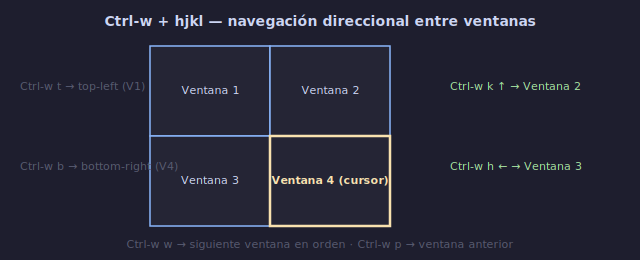

# 🧭 Navegación entre Ventanas y Buffers

## 🎯 Objetivos

- Dominar la navegación fluida entre ventanas y buffers sin interrumpir el flujo
- Configurar mappings para saltar entre splits con una sola combinación de teclas
- Implementar navegación de buffers estilo IDE
- Entender el arglist y quickfix para lotes de archivos

---

## 📋 Contenido

### 1. Navegación Nativa entre Ventanas



```text
Ctrl-w h → izquierda    Ctrl-w j → abajo
Ctrl-w k → arriba       Ctrl-w l → derecha
Ctrl-w w → siguiente    Ctrl-w p → anterior
Ctrl-w t → top-left     Ctrl-w b → bottom-right
```

```text
Ejemplo de navegación:
┌──────────┬──────────┐
│ Ventana 1│ Ventana 2│   Ctrl-w h ← → Ctrl-w l
├──────────┼──────────┤   Ctrl-w j ↓ ↑ Ctrl-w k
│ Ventana 3│ Ventana 4│
└──────────┴──────────┘
```

**El problema**: `Ctrl-w` + `hjkl` son 3 teclas. Demasiado para una acción tan frecuente.

---

### 2. Mappings de Navegación Simplificada

La solución: mapear `Ctrl-hjkl` directamente a la navegación de ventanas.

```lua
-- Navegación de splits con Ctrl + hjkl (sin Ctrl-w)
vim.keymap.set("n", "<C-h>", "<C-w>h", { desc = "Split izquierdo" })
vim.keymap.set("n", "<C-j>", "<C-w>j", { desc = "Split inferior" })
vim.keymap.set("n", "<C-k>", "<C-w>k", { desc = "Split superior" })
vim.keymap.set("n", "<C-l>", "<C-w>l", { desc = "Split derecho" })
```

```text
Antes:  Ctrl-w h   (3 teclas)
Ahora:  Ctrl-h     (2 teclas)

En un día típico de programación, navegas entre splits ~200 veces.
Ahorro: 200 pulsaciones/día.
```

**Nota para usuarios de terminal**: Algunos terminales interceptan `Ctrl-h` (backspace en algunas configuraciones). Si no funciona, prueba alternativas:

```lua
-- Alternativa con Alt + hjkl
vim.keymap.set("n", "<A-h>", "<C-w>h")
vim.keymap.set("n", "<A-j>", "<C-w>j")
vim.keymap.set("n", "<A-k>", "<C-w>k")
vim.keymap.set("n", "<A-l>", "<C-w>l")
```

---

### 3. Navegación entre Buffers

```text
:ls                 → listar buffers con sus números
:b {n}              → ir al buffer {n}
:b {nombre}         → ir al buffer con {nombre} (autocompleta con Tab)
:b# / Ctrl-6        → alternar último buffer
:bn / :bp           → siguiente/anterior buffer
:bf / :bl           → primer/último buffer
```

**Mappings recomendados**:

```lua
-- Navegación de buffers con leader
vim.keymap.set("n", "<leader>bn", "<cmd>bnext<CR>", { desc = "Buffer siguiente" })
vim.keymap.set("n", "<leader>bp", "<cmd>bprevious<CR>", { desc = "Buffer anterior" })
vim.keymap.set("n", "<leader>bd", "<cmd>bdelete<CR>", { desc = "Eliminar buffer" })

-- Alternar buffer con Tab
vim.keymap.set("n", "<Tab>", "<cmd>b#<CR>", { desc = "Alternar último buffer" })
vim.keymap.set("n", "<S-Tab>", "<cmd>b#<CR>", { desc = "Alternar último buffer" })

-- Buscar buffer (requiere telescope o fzf)
vim.keymap.set("n", "<leader>bb", "<cmd>ls<CR>:b<Space>", { desc = "Cambiar buffer" })
```

---

### 4. Navegación con el Arglist

El **arglist** es una lista de archivos que abriste al iniciar Vim. Útil para trabajar con un conjunto específico de archivos.

```text
:args                   → muestra la lista de argumentos
:arga {archivo}         → añade archivo al arglist
:argd {archivo}         → elimina archivo del arglist

:n                      → siguiente archivo en arglist (next)
:N / :prev              → anterior archivo (previous)
:rewind / :fir          → primer archivo (first)
:last                   → último archivo

:argdo {comando}        → ejecuta comando en TODOS los args
```

```text
Ejemplo — abrir todos los archivos .lua de un directorio:
nvim src/**/*.lua
:args
→ muestra todos los archivos
:argdo %s/foo/bar/g | update
→ sustituye "foo" por "bar" en TODOS y guarda
```

---

### 5. Navegación con Quickfix

El **quickfix list** es una lista de posiciones (líneas de error, resultados de búsqueda, etc.).

```text
:copen          → abre la ventana quickfix
:cclose         → cierra quickfix
:cnext / :cn    → siguiente ítem
:cprev / :cp    → ítem anterior
:cfirst / :cf   → primer ítem
:clast / :cl    → último ítem
```

```text
Ejemplo — buscar en múltiples archivos:
:vimgrep /función/g src/**/*.lua
:copen
→ lista todas las ocurrencias
:cnext → salta a cada ocurrencia
```

---

### 6. El Sistema "Jump List"

Vim mantiene un historial de saltos (jump list) que puedes navegar.

```text
Ctrl-o      → salto anterior (back)
Ctrl-i      → salto siguiente (forward)
:jumps      → muestra la lista de saltos
:clearjumps → limpia el historial
```

**¿Qué cuenta como "salto"?**
- `gg`, `G`, `:{n}`, `/{patrón}`, `?{patrón}`, `*`, `#`, `%`
- Marcas con `` ` `` o `'`
- `:b {n}` (cambiar de buffer)

```text
Flujo típico:
1. /función Enter     → saltas a una función
2. Ctrl-o             → vuelves a donde estabas
3. Ctrl-o             → un salto más atrás
4. Ctrl-i             → vuelves adelante
```

---

### 7. Workflow: Código + Tests + Documentación

```text
Layout típico de desarrollo:

┌───────────────────────┬────────────────┐
│ src/main.lua           │ test/main_    │
│ (código)               │ spec.lua      │
│                        │ (tests)       │
├───────────────────────┴────────────────┤
│ README.md / referencia / terminal      │
└────────────────────────────────────────┘

Configuración:
nvim src/main.lua
:vs test/main_spec.lua      → split vertical para tests
Ctrl-w j                    → ve abajo
:sp README.md               → split horizontal para docs
Ctrl-w =                    → iguala tamaños
```

**Navegación en este layout**:

```text
Ctrl-h → main.lua (código)
Ctrl-l → spec.lua (tests)
Ctrl-j → README.md (documentación)
Ctrl-k → vuelve al código

Tab    → alterna al buffer anterior (útil para ir entre test y código)
```

---

### 8. Mappings de Redimensión Rápida

```lua
-- Redimensionar con Ctrl + flechas
vim.keymap.set("n", "<C-Up>", "<cmd>resize +2<CR>", { desc = "Más alto" })
vim.keymap.set("n", "<C-Down>", "<cmd>resize -2<CR>", { desc = "Más bajo" })
vim.keymap.set("n", "<C-Right>", "<cmd>vertical resize +2<CR>", { desc = "Más ancho" })
vim.keymap.set("n", "<C-Left>", "<cmd>vertical resize -2<CR>", { desc = "Más estrecho" })

-- Igualar todo
vim.keymap.set("n", "<leader>=", "<C-w>=", { desc = "Igualar ventanas" })

-- Maximizar ventana actual (toggle)
vim.keymap.set("n", "<leader>m", "<cmd>MaximizerToggle<CR>", { desc = "Maximizar ventana" })
-- requiere plugin maximizer, o:
vim.keymap.set("n", "<leader>m", "<C-w>_<C-w>|", { desc = "Maximizar ventana" })
```

---

### 9. Workflow Completo de Navegación

```text
┌─────────────────────────────────────────────────────┐
│ MAPA DE NAVEGACIÓN IDEAL                              │
│                                                       │
│ Ctrl-hjkl       → navegar entre ventanas              │
│ Tab             → alternar entre código y test        │
│ <leader>bn/bp   → buffer siguiente/anterior           │
│ <leader>bd      → cerrar buffer                       │
│ Ctrl-o / Ctrl-i → navegar historial de saltos         │
│ Ctrl-^ / Ctrl-6 → último buffer                      │
│ <leader>=        → igualar tamaño de ventanas         │
│ Ctrl-flechas    → redimensionar ventanas              │
└─────────────────────────────────────────────────────┘
```

**Regla práctica**: Si necesitas algo más de 3 veces en un minuto, necesita un mapping.

---

## ✅ Checklist de Verificación

- [ ] Navego entre splits con `Ctrl-hjkl` (mappings configurados)
- [ ] Alterno buffers con `<leader>bn` / `<leader>bp`
- [ ] Salto al buffer anterior con `Tab` o `Ctrl-6`
- [ ] Uso `Ctrl-o` / `Ctrl-i` para el historial de saltos
- [ ] Redimensiono ventanas con mappings de Ctrl+flechas
- [ ] Igualo ventanas con `<leader>=`
- [ ] Puedo configurar un workspace de 3+ archivos en <1 minuto

---

## 🎮 Ejercicio Rápido

```text
1. Abre 3 archivos diferentes
2. Organízalos en 2 splits verticales + 1 horizontal
3. Navega entre ellos usando SOLO tus mappings
4. Redimensiona cada ventana con tus mappings
5. Iguala todo con <leader>=
6. Cierra una ventana y abre otra
7. Alterna buffers con Tab
8. Usa Ctrl-o para volver a posiciones anteriores
```

---

## ➡️ Siguiente

[04 - Pestañas](04-pestanas.md)
