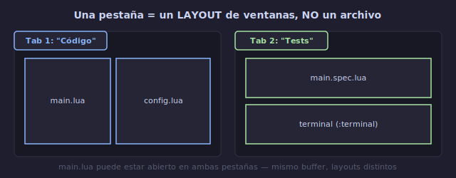

# 📑 Pestañas (Tabs)

## 🎯 Objetivos

- Entender la diferencia entre pestañas, buffers y ventanas
- Crear, cerrar y navegar entre pestañas
- Organizar layouts de trabajo con pestañas
- Evitar el antipatrón "1 archivo = 1 pestaña"

---

## 📋 Contenido

### 1. ¿Qué es una Pestaña en Vim?

Una pestaña (tab) en Vim **NO es un archivo**. Es una **colección de ventanas** (un layout).



```text
┌─────────────────────────────────────────┐
│ Tab 1: "Código"     Tab 2: "Tests"      │
│─────────────────────────────────────────│
│ ┌────────────┬────────────┐             │
│ │ main.lua   │ config.lua │             │
│ │            │            │             │
│ └────────────┴────────────┘             │
└─────────────────────────────────────────┘
```

**Diferencia con otros editores**:

```text
VS Code / Sublime:  1 pestaña = 1 archivo
Vim:                1 pestaña = 1 layout (colección de ventanas)

En Vim, las pestañas son "workspaces", no archivos individuales.
```

---

### 2. Crear y Cerrar Pestañas

```text
:tabnew [archivo]       → nueva pestaña (con archivo opcional)
:tabe [archivo]         → alias de :tabnew
:tabclose               → cerrar pestaña actual
:tabc                   → alias de :tabclose
:tabonly                → cerrar TODAS menos la actual
:tabo                   → alias de :tabonly

Ctrl-w T                → mover ventana actual a su propia pestaña
```

```text
Ejemplos:
:tabnew                 → pestaña vacía
:tabnew README.md       → pestaña con README.md
:tabclose               → cierra la pestaña actual
:tabonly                → cierra todas las demás
```

---

### 3. Navegar entre Pestañas

```text
:tabn {n}     → ir a la pestaña {n} (1-indexado)
:tabn         → siguiente pestaña (next)
:tabp         → pestaña anterior (previous)
:tabfirst     → primera pestaña
:tablast      → última pestaña

gt            → siguiente pestaña (go to next tab)
gT            → pestaña anterior (go to previous tab)
{n}gt         → ir a pestaña {n}
```

```text
Ejemplo — tienes 3 pestañas:
gt            → tab 1 → tab 2
gt            → tab 2 → tab 3
gT            → tab 3 → tab 2
2gt           → tab 2 (desde cualquier tab)
```

---

### 4. Organizar Pestañas: Workspaces

La forma correcta de usar pestañas es organizar **contextos de trabajo**:

```text
Tab 1: "Desarrollo"
┌──────────┬───────────┐
│ main.lua │ utils.lua │
├──────────┴───────────┤
│ terminal (para build) │
└──────────────────────┘

Tab 2: "Tests"
┌──────────┬──────────────────┐
│ spec.lua │ spec_helper.lua  │
└──────────┴──────────────────┘

Tab 3: "Documentación"
┌─────────────────────────────────────┐
│ README.md                           │
│ CHANGELOG.md                        │
└─────────────────────────────────────┘
```

```text
El antipatrón ❌:
Cada archivo en su propia pestaña (como VS Code).
Para eso usa buffers con :bn/:bp o Ctrl-6.

El buen patrón ✅:
Cada tarea o contexto en su propia pestaña.
```

---

### 5. Comandos Útiles con Pestañas

```text
:tabmove {n}     → mover pestaña a posición {n} (0-indexado)
:tabm 0          → mover al inicio
:tabm            → mover al final
:tabm +1         → mover una posición a la derecha
:tabm -1         → mover una posición a la izquierda

:tabdo {comando} → ejecutar comando en TODAS las pestañas
:tabdo %s/foo/bar/g | update
                 → sustituye foo por bar en todas las pestañas y guarda

:tab ball        → abrir cada buffer en su propia pestaña
:tab sball       → igual pero en ventanas (split all buffers)
```

---

### 6. Configuración Visual

```lua
-- Mostrar siempre la barra de pestañas
vim.opt.showtabline = 2   -- 0=never, 1=only if >1 tab, 2=always

-- Formato del título de pestaña
vim.opt.tabline = "%!v:lua.require('mi_config').tabline()"
```

**Atajos de teclado recomendados**:

```lua
-- Navegación de pestañas con leader
vim.keymap.set("n", "<leader>tn", "<cmd>tabnew<CR>", { desc = "Nueva pestaña" })
vim.keymap.set("n", "<leader>tc", "<cmd>tabclose<CR>", { desc = "Cerrar pestaña" })
vim.keymap.set("n", "<leader>to", "<cmd>tabonly<CR>", { desc = "Solo esta pestaña" })

-- Navegar pestañas con H/L (shift+h/l)
vim.keymap.set("n", "<S-h>", "<cmd>tabp<CR>", { desc = "Pestaña anterior" })
vim.keymap.set("n", "<S-l>", "<cmd>tabn<CR>", { desc = "Pestaña siguiente" })

-- Alternativa con Tab/Shift-Tab para pestañas
-- (si no usas Tab para buffer alternativo)
vim.keymap.set("n", "<A-h>", "<cmd>tabp<CR>")
vim.keymap.set("n", "<A-l>", "<cmd>tabn<CR>")
```

---

### 7. ¿Buffers o Pestañas?

```text
┌─────────────────────────────────────────────────────┐
│ BUFFERS vs PESTAÑAS: Regla de decisión               │
│                                                       │
│ Usa BUFFERS para:                                    │
│ • Archivos que visitas ocasionalmente                │
│ • Navegación rápida entre 2-3 archivos              │
│ • Cuando solo necesitas ver el contenido            │
│                                                       │
│ Usa PESTAÑAS para:                                   │
│ • Contextos de trabajo diferentes (dev vs docs)     │
│ • Layouts específicos que quieres preservar          │
│ • Agrupar ventanas relacionadas                     │
│ • Separar "modo edición" de "modo lectura"          │
└─────────────────────────────────────────────────────┘
```

**La regla de oro**: Si un archivo puede compartir ventana con otro, mismo tab. Si es un contexto completamente diferente, nuevo tab.

---

### 8. Sesiones: Guardar tu Workspace

Puedes guardar todo tu layout (pestañas, ventanas, buffers) como una sesión:

```text
:mksession ~/workspace.vim     → guarda sesión
:mks! ~/workspace.vim          → sobrescribe sesión existente

nvim -S ~/workspace.vim        → restaura sesión al abrir Vim
:source ~/workspace.vim        → restaura sesión desde dentro
```

**Sesiones automáticas** (plugin o config):

```lua
-- Autoguardar sesión al salir
vim.api.nvim_create_autocmd("VimLeave", {
    callback = function()
        vim.cmd("mks! ~/.local/share/nvim/session.vim")
    end,
})
```

---

## 💡 Resumen

```text
┌─────────────────────────────────────────────────────┐
│ PESTAÑAS                                             │
│                                                       │
│ :tabnew / :tabe         → nueva pestaña              │
│ :tabclose / :tabc       → cerrar pestaña             │
│ :tabonly / :tabo        → solo esta pestaña          │
│ gt / gT                 → siguiente/anterior         │
│ {n}gt                   → ir a pestaña {n}           │
│ :tabmove {n}            → reordenar pestañas         │
│ :tabdo {comando}        → ejecutar en todas          │
│                                                       │
│ Ctrl-w T                → ventana a nueva pestaña     │
│ :mksession              → guardar layout              │
└─────────────────────────────────────────────────────┘
```

---

## ✅ Checklist de Verificación

- [ ] Entiendo que pestaña = layout, no archivo individual
- [ ] Creo y cierro pestañas con `:tabnew` / `:tabclose`
- [ ] Navego entre pestañas con `gt` / `gT`
- [ ] Organizo workspaces por contexto (dev, test, docs)
- [ ] NO uso 1 pestaña por archivo
- [ ] Guardo sesiones con `:mksession`
- [ ] Tengo mappings para navegación de pestañas

---

## 🎮 Ejercicio Rápido

```text
1. Abre Vim con un archivo
2. :split archivo2.txt      → split horizontal
3. :tabnew archivo3.txt     → nueva pestaña
4. :vs archivo4.txt         → split vertical en pestaña 2
5. gt / gT                  → navega entre pestañas
6. 1gt                      → vuelve a pestaña 1
7. Ctrl-w T                 → mueve una ventana a su propia pestaña
8. :tabonly                 → cierra todas menos la actual
```

---

## ➡️ Siguiente

[05 - netrw y :help](05-netrw-y-help.md)
