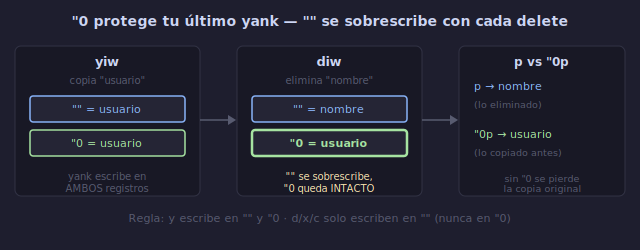

# 📋 Registros de Vim

## 🎯 Objetivos

- Entender qué son los registros y para qué sirven
- Dominar el registro sin nombre (`""`) y el registro de copia (`"0`)
- Usar registros con nombre (`"a`-`"z`) para almacenamiento explícito
- Acumular texto en registros con mayúsculas (`"A`-`"Z`)
- Visualizar y gestionar registros con `:reg`

---

## 📋 Contenido

### 1. ¿Qué es un Registro?

Un registro es un espacio de almacenamiento nombrado donde Vim guarda texto copiado, eliminado o grabado (macros). Piensa en ellos como un portapapeles múltiple.



```text
Editores normales:  1 portapapeles (Ctrl+C / Ctrl+V)
Vim:                ~40 registros para texto + ~26 para macros
```

**Cada registro tiene un nombre de 1 carácter.** Lo accedes con `"{carácter}`.

---

### 2. El Registro Sin Nombre (`""`)

Es el registro por defecto. Todo lo que eliminas (`d`, `x`, `c`, `s`) o copias (`y`) va aquí automáticamente.

```text
dd          → línea va a ""
yy          → línea va a ""
x           → carácter va a ""
ciw texto   → palabra vieja va a ""
p           → pega desde "" (el registro por defecto)
```

**No necesitas nombrarlo.** `p` y `""p` son equivalentes.

```text
:reg ""     → muestra el contenido del registro sin nombre
```

---

### 3. El Registro de Yank (`"0`)

Cuando copias (`y`), el texto va a `""` y TAMBIÉN a `"0`. Pero cuando eliminas (`d`/`x`/`c`), `""` se sobrescribe pero `"0` NO.

```text
yy          → copia línea → va a "" y "0
dd          → elimina línea → va a "" (sobrescribe), "0 CONSERVA la copia
p           → pega lo eliminado (desde "")
"0p         → pega lo copiado originalmente (desde "0)

Esto es crucial: "0 protege tu último yank.
```

```text
Ejemplo práctico:
1. yiw         → copias "usuario" → "0 = usuario
2. diw         → eliminas "nombre" → "" = nombre, "0 = usuario (intacto)
3. p           → pega "nombre" (lo eliminado)
4. "0p         → pega "usuario" (lo copiado originalmente)

Sin "0, habrías perdido la copia original.
```

---

### 4. Registros con Nombre (`"a`-`"z`)

26 registros que controlas explícitamente. El texto NO va a ellos automáticamente.

```text
"a y y       → copia línea al registro 'a' (yank to a)
"b d d       → elimina línea al registro 'b' (delete to b)
"c y i w     → copia palabra al registro 'c'
"d d i {     → elimina bloque al registro 'd'

"a p         → pega desde registro 'a'
"b p         → pega desde registro 'b'
```

```text
Ejemplo — almacenar 3 fragmentos diferentes:
1. "a yy      → línea 1 en registro 'a'
2. j "b yy    → línea 2 en registro 'b'
3. j "c yy    → línea 3 en registro 'c'

Ahora los 3 están disponibles:
G "a p        → pega línea 1 al final
"b p          → pega línea 2
"c p          → pega línea 3
```

---

### 5. Append a Registros (`"A`-`"Z`)

Las mayúsculas AÑADEN al registro en vez de sobrescribir.

```text
"a yy         → registro 'a' = "línea 1"
j "A yy       → registro 'a' = "línea 1\nlínea 2"
j "A yy       → registro 'a' = "línea 1\nlínea 2\nlínea 3"

"a p          → pega las 3 líneas juntas
```

```text
Caso de uso — recolectar líneas dispersas:
/ERROR        → busca primer error
"A dd         → añade línea al registro 'a'
n             → siguiente error
"A dd         → añade otra línea
n "A dd       → añade otra
...
G "a p        → al final, pega todas las líneas de error juntas
```

---

### 6. Visualizar Registros: `:reg`

```text
:reg                    → muestra todos los registros
:reg a b c              → muestra registros 'a', 'b', 'c'
:reg ""                 → muestra registro sin nombre
:reg 0                  → muestra registro de yank
:reg a-z                → muestra todos los registros con nombre
```

```text
Salida típica de :reg:
--- Registers ---
""   function calcular() {
"0   const datos = {}
"a   [ERROR] conexión fallida
"b   user_name
"c   -- TODO: refactorizar
"d   local M = {}
```

---

### 7. Otros Registros Especiales

| Registro | Contenido | Se actualiza |
|----------|-----------|-------------|
| `"%` | Nombre del archivo actual | Al cambiar de buffer |
| `"#` | Nombre del archivo alternativo | Al cambiar de buffer |
| `".` | Último texto insertado | Al salir de Insert mode |
| `":` | Último comando `:` ejecutado | Al ejecutar comando |
| `"/` | Último patrón de búsqueda | Al usar `/` o `?` |
| `"-` | Último texto pequeño eliminado (< 1 línea) | Al usar `x` o `d` en <1 línea |
| `"=` | Registro de expresión (evalúa expresiones) | Manual |

```text
Ejemplos:
"%p             → pega el nombre del archivo actual
:reg %          → muestra el nombre del archivo
"/p             → pega el último patrón de búsqueda
Ctrl-r .        → en Insert mode, pega último texto insertado
Ctrl-r %        → en Insert mode, pega nombre de archivo
```

---

### 8. Pegar desde Registros en Insert Mode

```text
Ctrl-r {reg}    → pega el contenido del registro en Insert mode

Ejemplos:
Ctrl-r "        → pega registro sin nombre
Ctrl-r 0        → pega registro de yank
Ctrl-r a        → pega registro 'a'
Ctrl-r %        → pega nombre de archivo
Ctrl-r /        → pega último patrón de búsqueda
```

---

### 9. Trabajando con Registros en Comandos

```text
:put a          → pega registro 'a' después de la línea actual
:put! a         → pega registro 'a' ANTES de la línea actual
:1put a         → pega en línea 1
:$put a         → pega al final del archivo

:@a             → ejecuta registro 'a' como comandos (macro)
```

---

### 10. Limpiar Registros

```text
:let @a = ''    → vacía el registro 'a'
:let @/ = ''    → limpia el patrón de búsqueda (equivale a :noh)

Para limpiar TODOS los registros con nombre:
:for i in range(char2nr('a'), char2nr('z')) | exe 'let @' . nr2char(i) . ' = ""' | endfor
```

---

## 💡 Tabla de Referencia Rápida

```text
┌─────────────────────────────────────────────────────┐
│ REGISTROS                                            │
│                                                      │
│ ""   → sin nombre (último delete/yank/change)       │
│ "0   → yank (última copia, inmune a deletes)        │
│ "1   → último delete de línea completa              │
│ "2   → penúltimo delete de línea completa            │
│ ...    (hasta "9, pila de deletes de línea)         │
│ "-   → último delete pequeño (<1 línea)             │
│ "a-z → registros con nombre (tú controlas)          │
│ "A-Z → append a registros con nombre                │
│ "%   → nombre del archivo actual                    │
│ "#   → nombre del archivo alternativo               │
│ ".   → último texto insertado                       │
│ ":   → último comando :                             │
│ "/   → último patrón de búsqueda                    │
│                                                      │
│ :reg             → ver todos los registros           │
│ "{reg}y{motion}  → copiar a registro                │
│ "{reg}p          → pegar desde registro             │
│ Ctrl-r {reg}     → pegar en Insert mode             │
└─────────────────────────────────────────────────────┘
```

---

## ✅ Checklist de Verificación

- [ ] Entiendo el registro sin nombre (`""`) y cómo se sobrescribe
- [ ] Uso `"0p` para recuperar la última copia tras un delete
- [ ] Almaceno texto en registros con nombre (`"ayy`, `"byw`)
- [ ] Acumulo texto con mayúsculas (`"Ayy`)
- [ ] Visualizo registros con `:reg`
- [ ] Pego registros en Insert mode con `Ctrl-r {reg}`

---

## 🎮 Ejercicio Rápido

```text
1. Abre un archivo de prueba
2. "a yy       → copia línea 1 a registro 'a'
3. j "b yy     → copia línea 2 a registro 'b'  
4. j "c yy     → copia línea 3 a registro 'c'
5. :reg a b c  → verifica los contenidos
6. G "a p      → pega 'a' al final
7. "b p        → pega 'b'
8. "c p        → pega 'c'
9. j dd        → elimina línea → "" se sobrescribe
10. "0p        → recupera la copia original (de yw)
```

---

## ➡️ Siguiente

[02 - Registro del Sistema](02-registro-sistema.md)
