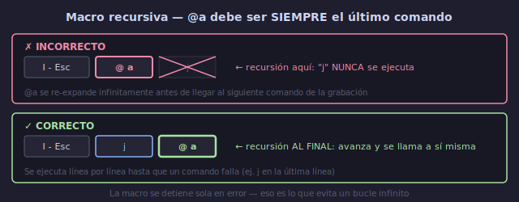

# 🔧 Macros: Edición, Batch y Recursividad

## 🎯 Objetivos

- Inspeccionar y editar macros usando el registro
- Corregir macros sin regrabarlas desde cero
- Crear macros recursivas que se llaman a sí mismas
- Usar `:global` con macros para procesamiento masivo
- Aplicar macros en lote de forma segura

---

## 📋 Contenido

### 1. Ver el Contenido de una Macro

Las macros se almacenan en registros. Puedes verlas con `:reg` o pegarlas para editarlas.



```text
:reg a          → muestra el contenido del registro 'a'
"a p            → pega el contenido en el buffer (para editarlo)

O directamente:
:echo @a        → muestra el contenido en la línea de comandos
```

```text
Ejemplo de salida de :reg a:
--- Registers ---
"a   0f,r:lI Nombre: ^[f,r:lI Edad: ^[f,r:lI Ciudad: ^[

Donde:
^[  → representa <Esc> (carácter de escape)
^M  → representa <Enter>
```

---

### 2. Editar una Macro

Cuando una macro tiene un error, no necesitas regrabarla entera. Puedes editarla.

```text
Método 1: Pegar, editar, guardar
1. "a p              → pega la macro en el buffer
2. Edítala como texto normal
3. "a y $            → copia la línea editada al registro 'a'

Método 2: Editar en línea de comandos
1. :let @a = "       → asigna directamente
2. Ctrl-r Ctrl-r a   → pega el contenido literal del registro
3. Edita la línea
4. "                 → cierra las comillas
5. Enter

Método 3: Append a registro existente
1. q A               → empieza grabación en APPEND a 'A'
2. (ejecuta comandos adicionales)
3. q                 → detiene → se añaden al registro 'a'
```

**Ejemplo práctico — corregir una macro**:

```text
Macro grabada en 'q' que convierte snake_case a CamelCase:
0 f _ x ~ w (pero tiene un error)

Pegarla:
"q p             → ves: "0f_x~w"

Error: después de `x` no necesita `~`, es `w` directamente.
Edición correcta: "0f_xl~w"

Recargarla:
"q y $           → copia la línea corregida a 'q'
dd               → elimina la línea del buffer
@q               → prueba la macro corregida
```

---

### 3. Macros Recursivas

Una macro recursiva se llama a sí misma al final. Se ejecuta hasta que encuentra un error.

```text
q a                     → grabar en 'a'
... tus comandos ...
j                       → avanzar a siguiente línea
@ a                     → ¡llamarse a sí misma!
q                       → detener grabación

Ahora: @a               → la macro se ejecuta línea por línea
                          hasta que j falla (fin del archivo)
```

**La recursión debe ser el ÚLTIMO comando.** Si pones `@a` y luego más comandos, esos comandos NUNCA se ejecutan porque `@a` se expande infinitamente.

```text
⚠️  ERROR COMÚN:
q a
  I - Esc
  @ a          ← recursión aquí
  j            ← ESTO NUNCA SE EJECUTA
q

✅ CORRECTO:
q a
  I - Esc
  j            ← avanza ANTES de la recursión
  @ a          ← recursión al final
q
```

**Macro recursiva con búsqueda**:

```text
q e                     → grabar
/ ERROR Enter           → busca "ERROR"
c w PROCESADO Esc       → cambia la palabra
n                       → siguiente ocurrencia (n = next search result)
@ e                     → recursión
q                       → detiene

@e                      → procesa todos los "ERROR" del archivo
                          (se detiene cuando no hay más coincidencias)
```

---

### 4. Aplicar Macros en Lote (Batch)

#### Con `:normal`

```text
:%normal @q              → ejecuta @q en CADA línea del archivo
:10,50normal @q          → ejecuta @q en líneas 10-50
:'a,'b normal @q         → ejecuta @q desde marca 'a' hasta 'b'
```

**Atención**: `:normal` ejecuta UNA vez por línea. Si tu macro ya incluye `j`, cada ejecución saltará 1 línea, resultando en procesar solo la mitad de las líneas.

```text
Solución: Dos tipos de macros
1. Macro CON j → para ejecución manual (@q repetido)
2. Macro SIN j → para :normal @q (sin avance)
```

#### Con `:global`

```text
:g/patrón/normal @q      → ejecuta @q en líneas que coinciden con patrón
:g/ERROR/normal @w       → macro 'w' en todas las líneas con "ERROR"
:v/^#/normal @f           → macro 'f' en líneas que NO son comentarios
```

#### Con número

```text
100 @q                   → ejecuta macro 'q' 100 veces
                          (se detiene antes si encuentra error)
```

---

### 5. Ejemplo Real: Procesar un Archivo de Log

```text
Archivo: server.log
[2024-01-15 10:30:01] INFO  Conexión aceptada desde 192.168.1.10
[2024-01-15 10:30:05] ERROR Timeout en consulta a base_datos
[2024-01-15 10:30:10] WARN  Memoria alta: 85%
[2024-01-15 10:30:15] INFO  Respuesta enviada a 192.168.1.10

Objetivo: Extraer solo los ERROR y formatearlos como JSON.

Estrategia:
1. Filtramos líneas con :g/ERROR
2. Para cada línea, macro que transforma a JSON

q j                     → grabar en 'j'  
0                       → inicio de línea  
f [                     → salta al '['  
x                       → elimina '['  
f ]                     → salta a ']'  
r ,                     → reemplaza ']' por ','  
I { "timestamp": " Esc   → inserta apertura JSON  
A ", "mensaje": "" Esc  → añade campo mensaje  
f E                     → salta a 'E' de ERROR  
y $                     → copia "ERROR Timeout..."  
A Esc                   → (ya está en Insert mode)  
Ctrl-r "                → pega el mensaje copiado  
A " } Esc               → cierra comillas y JSON  
j                       → siguiente línea  
@ j                     → recursión  
q                       → detiene

Ejecutar:
gg                      → inicio
/ ERROR Enter           → posiciona en primera línea con ERROR
@ j                     → ejecuta → procesa todas las líneas con ERROR

Resultado:
{ "timestamp": "2024-01-15 10:30:05", "mensaje": "ERROR Timeout en consulta a base_datos" }
```

---

### 6. Macros con `:let` (Asignación Directa)

Puedes asignar comandos a un registro sin grabarlos:

```text
:let @a = '0f,lr:j'           → asigna comandos literales a 'a'
:let @b = @a                  → copia registro 'a' a 'b'

Para comandos con Escape:
:let @a = "I// \<Esc>j"       → inserta "// " al inicio, baja línea
```

```text
Ctrl-r Ctrl-r {reg}        → en línea de comandos, pega registro LITERAL
Ctrl-r {reg}               → pega registro (puede interpretar caracteres)
```

---

### 7. Técnicas de Seguridad con Macros

```text
1. Prueba en copia:
   :w !cat > /tmp/backup.txt   → guarda respaldo
   (o simplemente guarda el archivo antes)

2. Deshacer global:
   Si la macro hace desastre: u → deshace todo

3. Confirmación visual:
   Graba la macro, pégala con :reg para revisar
   antes de ejecutar en lote

4. Macros incrementales:
   Ejecuta 1 vez, verifica, luego 5 veces, verifica,
   luego el resto

5. Guardar macros útiles:
   :let @a = '...comandos...'
   Guárdalas en un archivo o en tu init.lua
```

---

## 💡 Resumen

```text
┌─────────────────────────────────────────────────────┐
│ EDICIÓN DE MACROS                                    │
│                                                      │
│ :reg a             → inspeccionar macro              │
│ "ap                → pegar macro para editar         │
│ "ay$               → guardar línea editada al reg    │
│ :let @a = '...'    → asignar macro directamente      │
│ qA ... q           → append a macro existente        │
│                                                      │
│ BATCH                                                │
│ :%normal @q        → macro en todas las líneas       │
│ :g/patrón/normal @q → macro en líneas con patrón     │
│ {N}@q              → macro N veces                   │
│                                                      │
│ RECURSIVAS                                           │
│ qa ... @a q        → macro recursiva (último comando)│
│ Se detiene en error automáticamente                  │
└─────────────────────────────────────────────────────┘
```

---

## ✅ Checklist de Verificación

- [ ] Inspecciono macros con `:reg {reg}`
- [ ] Edito macros pegándolas, corrigiendo y recargando
- [ ] Creo macros recursivas con `@{reg}` al final
- [ ] Aplico macros en lote con `:%normal @{reg}`
- [ ] Uso `:g/patrón/normal @{reg}` para líneas específicas
- [ ] Asigno macros con `:let @a = '...'`

---

## 🎮 Ejercicio Rápido

```text
Crea un archivo con 20 líneas:
for i in $(seq 1 20); do echo "$i. tarea pendiente" >> ~/v-macro-batch.txt; done

1. q b                     → grabar
2. 0                       → inicio
3. f .                     → salta al punto
4. s )  Esc               → cambia punto por ')'
5. I - [ ]  Esc           → checkbox al inicio
6. q                       → detener

7. :%normal @b             → aplica a TODAS las líneas

8. u                       → deshacer

9. Ahora versión recursiva:
   q c
   0 f . s )  Esc I - [ ]  Esc j @c
   q
   (primero posiciona en línea 1) @c
   → procesa todas las líneas secuencialmente
```

---

## ➡️ Siguiente

[05 - Flujos Avanzados con Registros y Macros](05-flujos-registros-macros.md)
