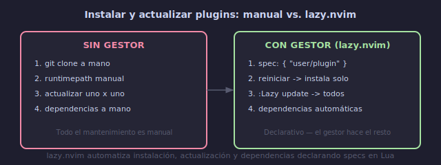

# 📦 Gestores de Plugins: lazy.nvim y vim-plug

## 🎯 Objetivos

- Entender qué es un gestor de plugins y por qué necesitas uno
- Conocer lazy.nvim (Neovim moderno) y vim-plug (Vim clásico)
- Instalar y configurar el bootstrap de lazy.nvim
- Elegir el gestor adecuado para tu entorno

---

## 📋 Contenido

### 1. ¿Qué es un Gestor de Plugins?

Un plugin manager automatiza la instalación, actualización y carga de plugins. Sin uno, tendrías que clonar repositorios manualmente y gestionar dependencias a mano.



```text
Sin gestor:
1. git clone https://github.com/plugin/x ~/.local/share/nvim/site/pack/...
2. Configurar runtimepath manualmente
3. Actualizar cada plugin manualmente (cd + git pull)
4. Gestionar dependencias entre plugins a mano

Con gestor:
1. Agregar una línea a tu configuración
2. Reiniciar Vim/Neovim → instalación automática
3. :Lazy update → actualiza todos
4. Dependencias resueltas automáticamente
```

---

### 2. lazy.nvim — El Estándar Moderno para Neovim

Creado por Folke Lemaitre. Es el gestor más popular en el ecosistema Neovim (2024+).

**Ventajas**:
- Lazy-loading automático y declarativo
- UI interactiva para gestionar plugins (`:Lazy`)
- Perfilado de tiempo de inicio integrado
- Organización modular de plugins
- Bloqueo de versiones (lockfile) para entornos reproducibles

**Instalación — Bootstrap**:

```lua
-- ~/.config/nvim/lua/config/lazy.lua
local lazypath = vim.fn.stdpath("data") .. "/lazy/lazy.nvim"
if not (vim.uv or vim.loop).fs_stat(lazypath) then
  local lazyrepo = "https://github.com/folke/lazy.nvim.git"
  local out = vim.fn.system({ "git", "clone", "--filter=blob:none", "--branch=stable", lazyrepo, lazypath })
  if vim.v.shell_error ~= 0 then
    vim.api.nvim_echo({
      { "Failed to clone lazy.nvim:\n", "ErrorMsg" },
      { out, "WarningMsg" },
      { "\nPress any key to exit..." },
    }, true, {})
    vim.fn.getchar()
    os.exit(1)
  end
end
vim.opt.rtp:prepend(lazypath)
```

```lua
-- ~/.config/nvim/init.lua
require("config.lazy")  -- carga el bootstrap
require("lazy").setup("plugins")  -- carga specs desde lua/plugins/
```

---

### 3. Estructura de Plugins con lazy.nvim

```text
~/.config/nvim/
├── init.lua                    → punto de entrada
├── lua/
│   ├── config/
│   │   └── lazy.lua            → bootstrap de lazy.nvim
│   └── plugins/                 → specs de plugins (modular)
│       ├── ui.lua               → temas, statusline, file tree
│       ├── editing.lua          → comentarios, surround, autopairs
│       ├── lsp.lua              → LSP, autocompletado
│       ├── git.lua              → gitsigns, fugitive
│       └── tools.lua            → fuzzy finder, terminal, etc.
└── lazy-lock.json               → lockfile de versiones
```

**Sintaxis de un spec**:

```lua
-- lua/plugins/ui.lua
return {
  -- Plugin simple
  { "navarasu/onedark.nvim" },

  -- Plugin con configuración
  {
    "nvim-lualine/lualine.nvim",
    dependencies = { "nvim-tree/nvim-web-devicons" },
    config = function()
      require("lualine").setup({
        options = { theme = "onedark" }
      })
    end,
  },
}
```

---

### 4. vim-plug — Alternativa para Vim Clásico

Creado por Junegunn Choi. Minimalista, compatible con Vim y Neovim.

**Ventajas**:
- Sintaxis simple y declarativa
- Instalación/actualización en paralelo
- Soporta carga bajo demanda (on-demand loading)
- Funciona en Vim y Neovim

**Instalación**:

```vim
" ~/.vimrc o ~/.config/nvim/init.vim (Vim clásico)
call plug#begin('~/.vim/plugged')

Plug 'morhetz/gruvbox'
Plug 'preservim/nerdtree'
Plug 'tpope/vim-fugitive'

call plug#end()
```

**Comandos**:
```text
:PlugInstall     → instalar plugins
:PlugUpdate      → actualizar plugins
:PlugClean       → eliminar plugins no listados
:PlugStatus      → estado de plugins
```

**On-demand loading con vim-plug**:
```vim
Plug 'preservim/nerdtree', { 'on': 'NERDTreeToggle' }
Plug 'tpope/vim-fugitive', { 'on': [] }  " lazy-load
```

---

### 5. Comparativa

```text
┌──────────────────┬────────────────────┬──────────────┐
│ Característica   │ lazy.nvim           │ vim-plug      │
├──────────────────┼────────────────────┼──────────────┤
│ Plataforma       │ Solo Neovim         │ Vim + Neovim  │
│ Lenguaje config  │ Lua (nativo)        │ Vimscript     │
│ Lazy-loading     │ Automático y fino   │ Manual (on)   │
│ UI de gestión    │ Sí (:Lazy)          │ No            │
│ Lockfile         │ Sí (lazy-lock.json) │ Sí (snapshot) │
│ Dependencias     │ Automáticas         │ Manual (Plug) │
│ Perfilado start  │ Sí                  │ No            │
│ Comunidad actual │ Muy activa          │ Madura        │
│ Recomendado para │ Neovim 0.8+         │ Vim clásico   │
└──────────────────┴────────────────────┴──────────────┘
```

**Recomendación**: Si usas Neovim → lazy.nvim. Si estás en Vim clásico → vim-plug.

---

### 6. Comandos de lazy.nvim

```text
:Lazy              → UI de gestión (instalar, actualizar, limpiar)
:Lazy sync         → sincronizar plugins (instalar + actualizar + limpiar)
:Lazy install      → instalar plugins faltantes
:Lazy update       → actualizar todos los plugins
:Lazy clean        → eliminar plugins no referenciados
:Lazy restore      → restaurar desde lockfile
:Lazy profile      → perfil de tiempo de inicio
:Lazy log          → ver logs de actualizaciones
:Lazy debug        → información de depuración
```

---

### 7. Migrar de vim-plug a lazy.nvim

Si vienes de vim-plug, la migración es directa:

```vim
" vim-plug (antes)
Plug 'nvim-lua/plenary.nvim'
Plug 'nvim-telescope/telescope.nvim', { 'branch': '0.1.x' }
```

```lua
-- lazy.nvim (después)
{
  "nvim-telescope/telescope.nvim",
  branch = "0.1.x",
  dependencies = { "nvim-lua/plenary.nvim" }
}
```

---

## 💡 Resumen

```text
┌─────────────────────────────────────────────────────┐
│ GESTORES DE PLUGINS                                   │
│                                                       │
│ lazy.nvim (Neovim):                                  │
│   Bootstrap en lua/config/lazy.lua                   │
│   Specs en lua/plugins/*.lua                         │
│   UI: :Lazy, :Lazy sync                             │
│                                                       │
│ vim-plug (Vim clásico):                              │
│   Configuración en .vimrc/init.vim                   │
│   Comandos: :PlugInstall, :PlugUpdate               │
│                                                       │
│ Estructura modular recomendada:                      │
│   lua/plugins/ui.lua                                 │
│   lua/plugins/editing.lua                            │
│   lua/plugins/lsp.lua                                │
│   lua/plugins/git.lua                                │
│   lua/plugins/tools.lua                              │
└─────────────────────────────────────────────────────┘
```

---

## ✅ Checklist de Verificación

- [ ] Entiendo la diferencia entre lazy.nvim (Neovim) y vim-plug (Vim)
- [ ] Bootstrap de lazy.nvim configurado en `lua/config/lazy.lua`
- [ ] Estructura modular en `lua/plugins/`
- [ ] `:Lazy` abre la UI de gestión
- [ ] `:Lazy sync` instala y actualiza plugins

---

## 🎮 Ejercicio Rápido

```text
1. Crea ~/.config/nvim/lua/config/lazy.lua con el bootstrap
2. Crea ~/.config/nvim/lua/plugins/init.lua vacío
3. En init.lua: require("config.lazy"); require("lazy").setup("plugins")
4. :Lazy → debería abrir la UI (vacía por ahora)
5. Agrega tu primer plugin: { "navarasu/onedark.nvim" } en ui.lua
6. :Lazy sync → instala
7. :colorscheme onedark → verifica que funciona
```

---

## ➡️ Siguiente

[02 - Configuración Modular con lazy.nvim](02-configuracion-modular-lazy.md)
