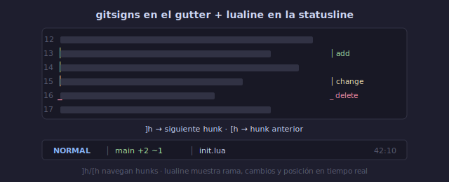

# 🔀 Git y Statusline

## 🎯 Objetivos

- Configurar gitsigns.nvim para ver cambios de git en el gutter
- Usar vim-fugitive para operaciones git desde Vim
- Configurar una statusline informativa con lualine.nvim
- Ver rama git, modo, posición y diagnóstico en la barra de estado

---

## 📋 Contenido

### 1. gitsigns.nvim — Git en el Gutter

Muestra indicadores visuales de cambios git en la columna de signos (gutter).



**Instalación**:

```lua
-- lua/plugins/git.lua
{
  "lewis6991/gitsigns.nvim",
  event = { "BufReadPre", "BufNewFile" },
  opts = {
    signs = {
      add          = { text = "│" },
      change       = { text = "│" },
      delete       = { text = "_" },
      topdelete    = { text = "‾" },
      changedelete = { text = "~" },
      untracked    = { text = "┆" },
    },
    signcolumn = true,
    numhl = false,
    linehl = false,
    word_diff = false,
    watch_gitdir = { interval = 1000, follow_files = true },
    current_line_blame = true,     -- blame de línea actual
    current_line_blame_opts = {
      virt_text = true,
      virt_text_pos = "eol",
      delay = 1000,
    },
  },
}
```

**Comandos y keymaps**:

```lua
-- En opts o config:
keys = {
  {
    "<leader>gb",
    function()
      require("gitsigns").blame_line({ full = true })
    end,
    desc = "Git blame línea",
  },
  {
    "<leader>gp",
    function()
      require("gitsigns").preview_hunk()
    end,
    desc = "Previsualizar hunk",
  },
  {
    "<leader>gt",
    function()
      require("gitsigns").toggle_current_line_blame()
    end,
    desc = "Toggle blame inline",
  },
  {
    "]h",
    function()
      if vim.wo.diff then return "]h" end
      vim.schedule(function() require("gitsigns").next_hunk() end)
      return "<Ignore>"
    end,
    desc = "Siguiente hunk",
  },
  {
    "[h",
    function()
      if vim.wo.diff then return "[h" end
      vim.schedule(function() require("gitsigns").prev_hunk() end)
      return "<Ignore>"
    end,
    desc = "Hunk anterior",
  },
}
```

**Navegación entre hunks**:
```text
]h   → siguiente hunk (cambio)
[h   → hunk anterior
]c   → siguiente hunk (alternative en modo diff)
[c   → hunk anterior (alternative)
```

---

### 2. vim-fugitive — Git Completo desde Vim

El plugin de git más completo para Vim, creado por tpope.

**Instalación**:

```lua
-- lua/plugins/git.lua
{
  "tpope/vim-fugitive",
  cmd = { "Git", "G", "Gstatus", "Gdiffsplit", "Gblame", "Glog" },
}
```

**Comandos esenciales**:

```text
:Git              → ejecuta cualquier comando git
:G                → status de git (ventana navegable)
:G <comando>      → ejecuta comando git y muestra resultado
:Gdiffsplit       → split con diff del archivo actual
:Gblame           → git blame en ventana lateral
:Glog             → historial de commits del archivo
:Gedit HEAD~:./%  → abre versión anterior del archivo
:Gread            → descarta cambios y lee del index
:Gwrite           → hace stage del archivo actual
:Gcommit          → commit con editor de Vim
:Gpush / :Gpull   → push/pull
```

**Navegar en :G status**:
```text
-      → stage/unstage archivo o hunk bajo el cursor
=      → toggle diff del archivo
cc     → commit (abre ventana de mensaje)
ca     → amend commit
cA     → amend commit sin editar mensaje
X      → descartar cambios (careful!)
```

**Mappings recomendados**:

```lua
vim.keymap.set("n", "<leader>gg", "<cmd>Git<CR>", { desc = "Git status" })
vim.keymap.set("n", "<leader>gc", "<cmd>Gcommit<CR>", { desc = "Git commit" })
vim.keymap.set("n", "<leader>gp", "<cmd>Gpush<CR>", { desc = "Git push" })
vim.keymap.set("n", "<leader>gl", "<cmd>Gpull<CR>", { desc = "Git pull" })
vim.keymap.set("n", "<leader>gb", "<cmd>Gblame<CR>", { desc = "Git blame" })
vim.keymap.set("n", "<leader>gd", "<cmd>Gdiffsplit<CR>", { desc = "Git diff" })
vim.keymap.set("n", "<leader>go", "<cmd>GBrowse<CR>", { desc = "Abrir en GitHub" })
```

---

### 3. lualine.nvim — Barra de Estado Profesional

Una statusline rica en información: modo, rama git, tipo de archivo, posición, diagnóstico.

**Instalación**:

```lua
-- lua/plugins/ui.lua
{
  "nvim-lualine/lualine.nvim",
  dependencies = { "nvim-tree/nvim-web-devicons" },
  lazy = false,  -- cargar al inicio
  opts = {
    options = {
      theme = "auto",             -- se adapta al colorscheme
      component_separators = { left = "", right = "" },
      section_separators = { left = "", right = "" },
      disabled_filetypes = { "neo-tree", "NvimTree" },
    },
    sections = {
      lualine_a = { "mode" },
      lualine_b = { "branch", "diff", "diagnostics" },
      lualine_c = { "filename" },
      lualine_x = { "encoding", "fileformat", "filetype" },
      lualine_y = { "progress" },
      lualine_z = { "location" },
    },
  },
}
```

**Qué muestra cada sección**:
```text
┌─────────────────────────────────────────────────┐
│ NORMAL │ main +2 ~3  │ init.lua │ utf-8 lua │ 70% │ 42:10 │
│   ↑         ↑    ↑        ↑          ↑       ↑      ↑
│  modo     rama diff  diag    archivo    encoding posición
└─────────────────────────────────────────────────┘
```

**Temas disponibles**:
```text
"auto"          → usa el colorscheme actual
"onedark"       → tema oscuro popular
"catppuccin"    → tema pastel
"tokyonight"    → tema nocturno
"gruvbox"       → tema retro
"nord"          → tema nórdico
```

---

### 4. Componentes de lualine

```lua
-- lualine_b (información de VCS y diagnóstico)
lualine_b = {
  "branch",              -- rama git actual
  "diff",                -- cambios (+2 ~3 -1)
  {
    "diagnostics",       -- errores/warnings del LSP
    sources = { "nvim_diagnostic" },
    sections = { "error", "warn", "info", "hint" },
    symbols = {
      error = " ",
      warn  = " ",
      info  = " ",
      hint  = " ",
    },
  },
},

-- lualine_c (archivo actual)
lualine_c = {
  {
    "filename",
    path = 1,             -- 0: nombre, 1: relativo, 2: absoluto
    shorting_target = 40, -- acortar si es muy largo
    symbols = {
      modified = "●",     -- archivo modificado
      readonly = "",    -- solo lectura
    },
  },
},

-- lualine_z (ubicación)
lualine_z = {
  "location"              -- 42:10 (línea:columna)
},
```

---

### 5. vim-fugitive Workflow Típico

```text
Flujo diario con fugitive:

1. Editas código normalmente
   → gitsigns muestra cambios en gutter

2. :Git (o <leader>gg)
   → ves el status de git
   → '-' sobre archivos para stagear
   → navegas hunks con ]h / [h

3. :Gcommit (o <leader>gc)
   → escribes mensaje de commit
   → :wq para confirmar

4. :Gpush (o <leader>gp)
   → push a remoto

5. Si algo sale mal:
   :Gdiffsplit → ver diff con HEAD
   :Gread → descartar cambios
   :Gblame → quién escribió esta línea
```

---

## 💡 Resumen

```text
┌─────────────────────────────────────────────────────┐
│ GIT + STATUSLINE                                      │
│                                                       │
│ gitsigns:                                             │
│   ]h / [h       → navegar hunks                     │
│   <leader>gb    → git blame                         │
│   <leader>gp    → preview hunk                      │
│                                                       │
│ fugitive:                                             │
│   <leader>gg    → :Git (status)                     │
│   <leader>gc    → :Gcommit                          │
│   <leader>gd    → :Gdiffsplit                       │
│                                                       │
│ lualine:                                              │
│   Modo │ Rama │ Cambios │ Diag │ Archivo │ Posición │
│   lazy = false (cargar siempre)                      │
└─────────────────────────────────────────────────────┘
```

---

## ✅ Checklist de Verificación

- [ ] gitsigns muestra cambios en el gutter (+, ~, -)
- [ ] Navego hunks con `]h` / `[h`
- [ ] `:G` o `<leader>gg` abre status de git
- [ ] Puedo hacer stage/unstage con `-` en :G status
- [ ] lualine muestra modo, rama git y posición
- [ ] lualine muestra diagnóstico de LSP (si configurado)

---

## 🎮 Ejercicio Rápido

```text
1. Abre un archivo en un repo git
2. Haz algunos cambios y guarda
3. ]h / [h → navega los hunks
4. <leader>gp → previsualiza el hunk actual
5. <leader>gg → abre :Git, navega con j/k
6. - sobre un archivo → stage
7. cc → commit (escribe mensaje, :wq)
8. Verifica lualine: ¿muestra la rama? ¿los cambios?
```

---

## ➡️ Siguiente

[05 - Temas y Optimización](05-temas-y-optimizacion.md)
