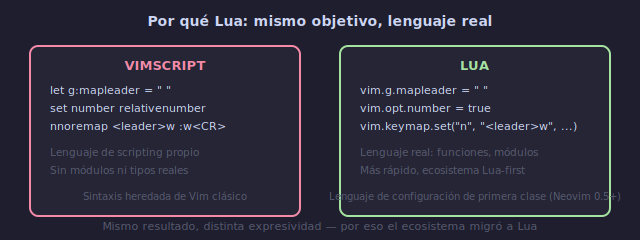

# 📘 Lua API de Neovim

## 🎯 Objetivos

- Entender los ámbitos de opciones: `vim.opt`, `vim.g`, `vim.bo`, `vim.wo`
- Usar `vim.cmd()` para ejecutar comandos Ex desde Lua
- Llamar funciones de Vimscript desde Lua con `vim.fn`
- Dominar la API básica para configurar Neovim en Lua

---

## 📋 Contenido

### 1. La Filosofía: Por Qué Lua

Neovim 0.5+ adoptó Lua como lenguaje de configuración de primera clase. Ventajas sobre Vimscript:



```text
Vimscript:                    Lua:
let g:mapleader = " "         vim.g.mapleader = " "
set number relativenumber     vim.opt.number = true
                              vim.opt.relativenumber = true
nnoremap <leader>w :w<CR>    vim.keymap.set("n", "<leader>w", "<cmd>w<CR>")
```

```text
Ventajas de Lua:
- Lenguaje real (funciones, módulos, estructuras de datos)
- Más rápido que Vimscript
- Sintaxis familiar (similar a Python/Ruby/JS)
- Mejor para configuraciones complejas (plugins, LSP)
- Comunidad activa (la mayoría de plugins nuevos son Lua-first)
```

---

### 2. `vim.opt` — Opciones de Vim

Acceso tipo "options" para las opciones de Vim. Maneja automáticamente strings, números y booleanos.

```lua
-- Booleanos: true/false
vim.opt.number = true
vim.opt.relativenumber = true
vim.opt.wrap = false
vim.opt.expandtab = true

-- Números
vim.opt.tabstop = 4
vim.opt.shiftwidth = 4
vim.opt.scrolloff = 8
vim.opt.timeoutlen = 300

-- Strings
vim.opt.background = "dark"
vim.opt.clipboard = "unnamedplus"
vim.opt.fillchars = { eob = " " }

-- Listas (append/prepend)
vim.opt.wildignore:append({ "*.o", "*.class" })
vim.opt.path:prepend("/usr/local/bin")

-- Ver valor actual
print(vim.opt.number:get())        → true
print(vim.opt.tabstop:get())       → 4
```

```text
Equivalencia Vimscript → Lua:
set number           → vim.opt.number = true
set nonumber         → vim.opt.number = false
set tabstop=4        → vim.opt.tabstop = 4
set background=dark  → vim.opt.background = "dark"
set wildignore+=*.o  → vim.opt.wildignore:append("*.o")
```

---

### 3. Ámbitos de Configuración

Vim tiene 4 niveles de ámbito para opciones:

```lua
vim.opt    → global + local al buffer/ventana (se aplica a ambos)
vim.bo     → solo buffer-local (buffer option)
vim.wo     → solo window-local (window option)
vim.g      → global (variables globales, no opciones de Vim)
vim.b      → buffer-local (variables por buffer)
vim.w      → window-local (variables por ventana)
vim.env    → variables de entorno del sistema
```

```lua
-- Ejemplos de cada ámbito:

-- vim.g: variables globales (NO son opciones de Vim)
vim.g.mapleader = " "
vim.g.maplocalleader = " "
vim.g.netrw_banner = 0

-- vim.opt: opciones (global + buffer-local)
vim.opt.number = true
vim.opt.tabstop = 4

-- vim.bo: solo buffer-local
vim.bo.tabstop = 2          -- este buffer usa 2 espacios
print(vim.bo.filetype)      → "lua"
vim.bo.filetype = "javascript"

-- vim.wo: solo window-local
vim.wo.cursorline = true     -- esta ventana resalta línea
vim.wo.spell = true          -- esta ventana tiene spell check

-- vim.env: variables de entorno
print(vim.env.HOME)          → "/home/usuario"
vim.env.MY_VAR = "hello"
```

```text
Regla práctica:
- Opciones de Vim (number, tabstop, etc.) → vim.opt
- Variables de plugins (mapleader, netrw_*) → vim.g
- Config por tipo de archivo → vim.bo
- Config visual por ventana → vim.wo
```

---

### 4. `vim.cmd()` — Ejecutar Comandos Ex

Ejecuta cualquier comando de Vim como string desde Lua.

```lua
-- Comandos simples
vim.cmd("colorscheme onedark")
vim.cmd("set number")
vim.cmd("write")
vim.cmd("quit")

-- Comandos con variables Lua interpoladas
local file = "config.lua"
vim.cmd("edit " .. file)
vim.cmd(string.format("split %s", file))

-- Bloques multilínea (heredoc de Lua)
vim.cmd([[
  highlight MyGroup guibg=#ff0000
  augroup my_group
    autocmd!
  augroup END
]])
```

**Cuándo usar `vim.cmd()`**:
- Comandos que no tienen API Lua (pocos, pero existen)
- Bloques de Vimscript heredados que no quieres reescribir
- Múltiples comandos en secuencia (más legible como bloque)

**Cuándo NO usar `vim.cmd()`**:
- Opciones de Vim → usar `vim.opt`
- Keymaps → usar `vim.keymap.set`
- Autocmds → usar `vim.api.nvim_create_autocmd` (más limpio)

---

### 5. `vim.fn` — Llamar Funciones de Vim

Accede a cualquier función built-in de Vimscript desde Lua.

```lua
-- Información del sistema
vim.fn.getcwd()              → directorio actual
vim.fn.expand("%:p")         → ruta completa del archivo
vim.fn.expand("%:t")         → solo nombre del archivo
vim.fn.filereadable("x.lua") → ¿el archivo existe?
vim.fn.executable("git")     → ¿el comando existe?

-- Buffers y ventanas
vim.fn.bufnr("%")            → número del buffer actual
vim.fn.winnr()               → número de la ventana actual
vim.fn.tabpagenr()           → número de la pestaña actual

-- Sistema
vim.fn.system("ls -la")      → ejecuta comando (captura salida)
vim.fn.systemlist("ls")      → salida como lista de líneas
vim.fn.stdpath("config")     → ~/.config/nvim
vim.fn.stdpath("data")       → ~/.local/share/nvim
```

```lua
-- Ejemplo: función útil para determinar SO
local function is_windows()
  return vim.fn.has("win32") == 1 or vim.fn.has("win64") == 1
end

-- Ejemplo: abrir URL en navegador
local function open_browser(url)
  if is_windows() then
    vim.fn.system({ "cmd", "/c", "start", url })
  elseif vim.fn.has("mac") == 1 then
    vim.fn.system({ "open", url })
  else
    vim.fn.system({ "xdg-open", url })
  end
end
```

---

### 6. `vim.api` — API de Neovim

Funciones de bajo nivel para interactuar con Neovim:

```lua
-- Crear autocmds
vim.api.nvim_create_autocmd("BufWritePre", {
  pattern = "*.lua",
  callback = function() vim.lsp.buf.format() end,
})

-- Crear comandos de usuario
vim.api.nvim_create_user_command("Reload", function()
  vim.cmd("source ~/.config/nvim/init.lua")
end, {})

-- Ejecutar en contexto de Neovim
vim.api.nvim_exec("echo 'hello'", true)  → true = capturar salida
vim.api.nvim_command("colorscheme onedark")

-- Buffers
vim.api.nvim_buf_get_name(0)     → nombre del buffer actual
vim.api.nvim_buf_get_option(0, "ft") → filetype del buffer actual
```

---

## 💡 Resumen

```text
┌─────────────────────────────────────────────────────────┐
│ LUA API DE NEOVIM                                         │
│                                                           │
│ OPCIONES:                                                 │
│   vim.opt.{opcion}    → opciones de Vim                  │
│   vim.g.{variable}    → variables globales               │
│   vim.bo.{opcion}     → buffer-local                     │
│   vim.wo.{opcion}     → window-local                     │
│   vim.env.{variable}  → variables de entorno             │
│                                                           │
│ EJECUCIÓN:                                                │
│   vim.cmd("comando")  → ejecutar Ex                      │
│   vim.fn.funcion()    → llamar función Vimscript         │
│   vim.api.metodo()    → API de Neovim                    │
│                                                           │
│ REGLA: opciones → vim.opt, comandos → vim.cmd,           │
│        funciones vim → vim.fn, API nueva → vim.api       │
└─────────────────────────────────────────────────────────┘
```

---

## ✅ Checklist de Verificación

- [ ] Uso `vim.opt` para configurar opciones de Vim
- [ ] Diferencio `vim.opt`, `vim.g`, `vim.bo`, `vim.wo`
- [ ] Uso `vim.cmd()` solo cuando no hay alternativa Lua
- [ ] Llamo funciones Vimscript con `vim.fn`
- [ ] Uso `vim.fn.stdpath("config")` para rutas

---

## 🎮 Ejercicio Rápido

```text
1. Convierte estas opciones de Vimscript a Lua:
   set number relativenumber tabstop=2 shiftwidth=2
   let g:mapleader = " "
   set background=dark clipboard=unnamedplus

   Solución:
   vim.opt.number = true
   vim.opt.relativenumber = true
   vim.opt.tabstop = 2
   vim.opt.shiftwidth = 2
   vim.g.mapleader = " "
   vim.opt.background = "dark"
   vim.opt.clipboard = "unnamedplus"

2. :lua print(vim.fn.expand("%:p"))  → muestra ruta del archivo
3. :lua print(vim.bo.filetype)       → muestra tipo de archivo
```

---

## ➡️ Siguiente

[02 - Keymappings Avanzados](02-keymappings-avanzados.md)
