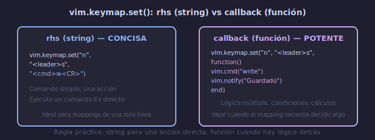

# ⌨️ Keymappings Avanzados con Lua

## 🎯 Objetivos

- Dominar `vim.keymap.set()` con todas sus opciones
- Crear mappings con descripciones para which-key
- Usar `callback` en lugar de `rhs` para lógica compleja
- Crear mappings condicionales y por tipo de archivo
- Organizar mappings en archivos modulares

---

## 📋 Contenido

### 1. `vim.keymap.set()` — API Moderna

```lua
vim.keymap.set({modo}, {teclas}, {acción}, {opciones})
--               ↑        ↑         ↑         ↑
--          "n" "i" "v"  teclas   comando    desc, buffer...
```

**Modos**:

| Código | Modo |
|--------|------|
| `"n"` | Normal |
| `"i"` | Insert |
| `"v"` | Visual + Select |
| `"x"` | Solo Visual |
| `"s"` | Solo Select |
| `"t"` | Terminal |
| `"o"` | Operator-pending |
| `"c"` | Command-line |
| `""`  | Normal + Visual + Operator-pending |

```lua
-- Mapping básico
vim.keymap.set("n", "<leader>w", "<cmd>w<CR>")

-- Con descripción (aparece en which-key)
vim.keymap.set("n", "<leader>w", "<cmd>w<CR>", { desc = "Guardar" })

-- Mapping con múltiples modos
vim.keymap.set({ "n", "v" }, "<leader>y", '"+y', { desc = "Copiar al sistema" })
```

---

### 2. `rhs` vs `callback`



```lua
-- Forma CONCISA: rhs (right-hand side) como string
vim.keymap.set("n", "<leader>s", "<cmd>w<CR>", { desc = "Guardar" })

-- Forma POTENTE: callback como función Lua
vim.keymap.set("n", "<leader>s", function()
  vim.cmd("write")
  vim.notify("Archivo guardado", vim.log.levels.INFO)
end, { desc = "Guardar con notificación" })
```

**Cuándo usar cada uno**:
- `rhs` string: comando simple, una acción
- `callback`: lógica múltiple, condiciones, cálculos

```lua
-- Ejemplo callback complejo: toggle entre número relativo y absoluto
vim.keymap.set("n", "<leader>tr", function()
  vim.opt.relativenumber = not vim.opt.relativenumber:get()
  local status = vim.opt.relativenumber:get() and "ON" or "OFF"
  vim.notify("Relative number: " .. status, vim.log.levels.INFO)
end, { desc = "Toggle relative number" })
```

---

### 3. Tipos de rhs

```lua
-- 1. <cmd> (recomendado para comandos : en Normal mode)
vim.keymap.set("n", "<leader>w", "<cmd>write<CR>")
-- Ventaja: no sale de Normal mode, no afecta registros

-- 2. : (legacy, para casos específicos)
vim.keymap.set("n", "<leader>n", ":noh<CR>")
-- Equivalente, pero <cmd> es más limpio

-- 3. <Plug> (mapeos de plugins)
vim.keymap.set("n", "gc", "<Plug>(commentary_line)")

-- 4. Teclas literales
vim.keymap.set("i", "jj", "<Esc>")
vim.keymap.set("n", "<C-h>", "<C-w>h")

-- 5. Callback Lua
vim.keymap.set("n", "<leader>q", function()
  local buf = vim.api.nvim_get_current_buf()
  vim.api.nvim_buf_delete(buf, { force = false })
end, { desc = "Cerrar buffer" })
```

---

### 4. Opciones de `vim.keymap.set()`

```lua
{
  desc = "Guardar archivo",    -- descripción para which-key
  buffer = 0,                  -- buffer-local (0 = buffer actual)
  silent = true,               -- no mostrar en línea de comandos
  noremap = true,              -- no recursivo (default en set())
  nowait = true,               -- no esperar otras combinaciones
  expr = false,                -- rhs es una expresión
  replace_keycodes = false,    -- no reemplazar <Esc> etc.
}
```

**Buffer-local mappings**:
```lua
-- Mapping solo para el buffer actual
vim.keymap.set("n", "K", function()
  vim.lsp.buf.hover()
end, { buffer = 0 })  -- 0 = buffer actual

-- Mapping para un buffer específico
local bufnr = vim.api.nvim_get_current_buf()
vim.keymap.set("n", "K", vim.lsp.buf.hover, { buffer = bufnr })
```

**Expr mappings**:
```lua
-- El rhs se evalúa cada vez que se presiona la tecla
vim.keymap.set("n", "<leader>d", function()
  return vim.bo.filetype == "lua" and "<cmd>lua print('lua')<CR>" or "<cmd>echo 'otro'<CR>"
end, { expr = true, desc = "Comando contextual" })
```

---

### 5. Mappings por Tipo de Archivo

```lua
-- En lua/config/autocmds.lua o después de require("lazy").setup():
vim.api.nvim_create_autocmd("FileType", {
  pattern = { "python", "lua", "javascript" },
  callback = function(args)
    local opts = { buffer = args.buf }
    vim.keymap.set("n", "<leader>r", function()
      -- ejecutar archivo según lenguaje
      local cmd
      if vim.bo.filetype == "python" then
        cmd = "!python3 %"
      elseif vim.bo.filetype == "lua" then
        cmd = "luafile %"
      elseif vim.bo.filetype == "javascript" then
        cmd = "!node %"
      end
      vim.cmd(cmd)
    end, vim.tbl_extend("force", opts, { desc = "Ejecutar archivo" }))
  end,
})
```

---

### 6. Eliminar Mappings

```lua
-- Eliminar un mapping específico
vim.keymap.del("n", "<leader>x")

-- Eliminar todos los mappings de un buffer
vim.keymap.del("n", "", { buffer = 0 })

-- Desactivar teclas (mapping a <Nop>)
vim.keymap.set("n", "<Up>", "<Nop>", { desc = "Desactivar flecha arriba" })
vim.keymap.set("n", "<Down>", "<Nop>")
vim.keymap.set("n", "<Left>", "<Nop>")
vim.keymap.set("n", "<Right>", "<Nop>")
```

---

### 7. Organización Modular de Mappings

```lua
-- lua/core/keymaps.lua
local M = {}

function M.setup()
  local map = vim.keymap.set

  -- Grupo: Archivo
  map("n", "<leader>w", "<cmd>w<CR>", { desc = "Guardar" })
  map("n", "<leader>q", "<cmd>q<CR>", { desc = "Salir" })
  map("n", "<leader>x", "<cmd>x<CR>", { desc = "Guardar y salir" })

  -- Grupo: Navegación
  map("n", "<C-h>", "<C-w>h", { desc = "Split izquierdo" })
  map("n", "<C-j>", "<C-w>j", { desc = "Split inferior" })
  map("n", "<C-k>", "<C-w>k", { desc = "Split superior" })
  map("n", "<C-l>", "<C-w>l", { desc = "Split derecho" })

  -- Grupo: Buffers
  map("n", "<leader>bn", "<cmd>bnext<CR>", { desc = "Buffer siguiente" })
  map("n", "<leader>bp", "<cmd>bprevious<CR>", { desc = "Buffer anterior" })
  map("n", "<leader>bd", "<cmd>bdelete<CR>", { desc = "Eliminar buffer" })

  -- Grupo: Insert mode
  map("i", "jj", "<Esc>", { desc = "Salir de Insert" })
  map("i", "jk", "<Esc>", { desc = "Salir de Insert" })

  -- Grupo: Búsqueda
  map("n", "<leader>h", "<cmd>noh<CR>", { desc = "Limpiar búsqueda" })

  -- Grupo: Redimensión
  map("n", "<C-Up>", "<cmd>resize +2<CR>", { desc = "Más alto" })
  map("n", "<C-Down>", "<cmd>resize -2<CR>", { desc = "Más bajo" })
  map("n", "<C-Right>", "<cmd>vertical resize +2<CR>", { desc = "Más ancho" })
  map("n", "<C-Left>", "<cmd>vertical resize -2<CR>", { desc = "Más estrecho" })
  map("n", "<leader>=", "<C-w>=", { desc = "Igualar ventanas" })
end

return M
```

```lua
-- En init.lua:
require("core.keymaps").setup()
```

---

## 💡 Buenas Prácticas

```text
1. USA <cmd> en vez de : para comandos Ex
   <cmd>w<CR> ✓    :w<CR> ✗  (este último cambia de modo)

2. DESCRIPCIÓN para cada mapping
   which-key las usa para mostrarlas al usuario

3. CALLBACKS para lógica compleja
   No metas 5 comandos en un string, usa function()

4. BUFFER-LOCAL para mappings específicos
   Usa { buffer = 0 } para mappings solo en un archivo

5. AGREGA en grupos en which-key
   { "<leader>w", group = "Window" } en spec de which-key
```

---

## ✅ Checklist de Verificación

- [ ] Uso `vim.keymap.set()` en vez de `vim.api.nvim_set_keymap()`
- [ ] Cada mapping tiene `{ desc = "..." }`
- [ ] Uso `<cmd>` para comandos Ex
- [ ] Uso `callback` para lógica que requiere varias acciones
- [ ] Organizo mappings en `lua/core/keymaps.lua`
- [ ] Mappings buffer-local con `{ buffer = 0 }` donde aplica

---

## 🎮 Ejercicio Rápido

```text
1. Crea un mapping toggle:
   <leader>tc → toggle cursorline (on/off)

   vim.keymap.set("n", "<leader>tc", function()
     vim.wo.cursorline = not vim.wo.cursorline
   end, { desc = "Toggle cursorline" })

2. Crea un mapping que muestre fecha al guardar:
   <leader>w → guarda + notificación con hora

   vim.keymap.set("n", "<leader>ws", function()
     vim.cmd("write")
     local time = os.date("%H:%M:%S")
     vim.notify("Guardado a las " .. time)
   end, { desc = "Guardar con hora" })
```

---

## ➡️ Siguiente

[03 - Autocomandos (Autocmds)](03-autocmds.md)
