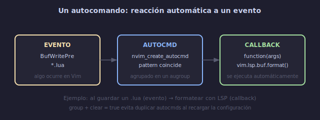

# ⚡ Autocomandos (Autocmds)

## 🎯 Objetivos

- Crear autocmds con `nvim_create_autocmd` para automatizar tareas
- Usar `augroup` para evitar duplicados al recargar configuración
- Conocer los eventos más útiles: `BufWritePre`, `FileType`, `LspAttach`, etc.
- Crear autocmds buffer-local y por patrón de archivo

---

## 📋 Contenido

### 1. ¿Qué es un Autocomando?

Un autocomando es una función que se ejecuta automáticamente en respuesta a un **evento** de Vim.



```text
Ejemplos cotidianos:
- Al guardar un archivo → formatear código
- Al abrir un .py → configurar indentación específica
- Al entrar a Insert mode → mostrar guía de columnas
- Al conectar un LSP → configurar atajos de teclado
```

---

### 2. `nvim_create_autocmd` — API Moderna

```lua
vim.api.nvim_create_autocmd({evento}, {
  pattern = {patrones},      -- tipos de archivo o buffers
  callback = function(args)   -- qué hacer cuando se dispara
    -- args.buf = buffer donde ocurrió
    -- args.file = archivo (si aplica)
    -- args.match = patrón que coincidió
  end,
  group = grupo,              -- augroup (importante)
  desc = "Descripción",       -- para :autocmd
  once = false,               -- ejecutar una sola vez
  nested = false,             -- permitir autocmds anidados
})
```

**Ejemplo simple**:
```lua
-- Mostrar trailing whitespace
vim.api.nvim_create_autocmd({ "BufWinEnter" }, {
  pattern = "*",
  callback = function()
    vim.wo.list = true
    vim.opt.listchars = { tab = "→ ", trail = "·", nbsp = "␣" }
  end,
  desc = "Mostrar caracteres invisibles",
})
```

---

### 3. Eventos Más Útiles

| Evento | Cuándo se dispara | Uso típico |
|--------|------------------|------------|
| `BufReadPre` | Antes de leer un archivo | Configurar antes de cargar |
| `BufReadPost` | Después de leer archivo | Navegar a última posición |
| `BufWritePre` | Antes de guardar | Formatear código |
| `BufWritePost` | Después de guardar | Ejecutar linters |
| `BufNewFile` | Al crear archivo nuevo | Plantilla automática |
| `FileType` | Al detectar tipo de archivo | Config por lenguaje |
| `InsertEnter` | Al entrar a Insert mode | Ajustes visuales |
| `InsertLeave` | Al salir de Insert mode | Restaurar ajustes |
| `VimResized` | Al redimensionar ventana | Igualar splits |
| `LspAttach` | Al conectar LSP a buffer | Keymaps de LSP |
| `ColorScheme` | Al cambiar tema | Ajustar highlights |
| `TextYankPost` | Al copiar texto | Resaltar yank |
| `TermOpen` | Al abrir terminal | Configurar terminal |
| `VimEnter` | Al iniciar Neovim | Tareas post-inicio |
| `VimLeavePre` | Antes de salir | Limpiar, guardar sesión |

---

### 4. Augroup: Evitar Duplicados

Cuando recargas tu configuración, los autocmds se acumulan. `augroup` los agrupa y limpia antes de recrearlos.

```lua
-- Forma CORRECTA: usa augroup
local group = vim.api.nvim_create_augroup("MiConfig", { clear = true })

vim.api.nvim_create_autocmd("BufWritePre", {
  group = group,
  pattern = "*.lua",
  callback = function()
    vim.lsp.buf.format()
  end,
  desc = "Formatear Lua al guardar",
})

-- clear = true → limpia el grupo antes de agregar
-- Esto evita duplicados al recargar init.lua
```

**Patrón estándar**:
```lua
-- lua/core/autocmds.lua
local M = {}

function M.setup()
  local augroup = vim.api.nvim_create_augroup
  local autocmd = vim.api.nvim_create_autocmd

  local general = augroup("General", { clear = true })

  -- Restaurar posición del cursor al abrir archivo
  autocmd("BufReadPost", {
    group = general,
    callback = function()
      local mark = vim.api.nvim_buf_get_mark(0, '"')
      if mark[1] > 1 and mark[1] <= vim.api.nvim_buf_line_count(0) then
        pcall(vim.api.nvim_win_set_cursor, 0, mark)
      end
    end,
    desc = "Ir a última posición al abrir",
  })

  -- Resaltar al copiar (yank)
  autocmd("TextYankPost", {
    group = general,
    callback = function()
      vim.highlight.on_yank({ higroup = "Visual", timeout = 200 })
    end,
    desc = "Resaltar texto copiado",
  })

  -- Formatear al guardar (varios lenguajes)
  local format_group = augroup("AutoFormat", { clear = true })
  autocmd("BufWritePre", {
    group = format_group,
    pattern = { "*.lua", "*.py", "*.js", "*.ts", "*.go" },
    callback = function()
      vim.lsp.buf.format({ async = false })
    end,
    desc = "Autoformatear al guardar",
  })
end

return M
```

---

### 5. Patrones de Archivo

```lua
-- Patrón simple
pattern = "*.lua"              -- solo archivos .lua
pattern = "*.py"               -- solo .py

-- Múltiples patrones
pattern = { "*.lua", "*.vim", "*.toml" }

-- Solo buffer específico
pattern = 0                    -- buffer actual

-- Excluir patrones
pattern = { "*.lua", "!test_*.lua" }  -- lua excepto test_*

-- Archivos en directorios específicos
pattern = { "~/proyectos/*.lua" }

-- Todos los archivos
pattern = "*"
```

---

### 6. Autocmds para Configuración por Tipo de Archivo

```lua
-- En lugar de autocmds, puedes usar ftplugin:
-- ~/.config/nvim/after/ftplugin/lua.lua
-- (se carga automáticamente para archivos .lua)

-- O con autocmd:
vim.api.nvim_create_autocmd("FileType", {
  group = augroup("FileTypeSettings", { clear = true }),
  pattern = { "lua", "python", "javascript", "markdown" },
  callback = function(args)
    local ft = vim.bo[args.buf].filetype
    local opts = { buffer = args.buf }

    if ft == "markdown" then
      vim.wo[args.buf].wrap = true
      vim.wo[args.buf].spell = true
    elseif ft == "python" then
      vim.bo[args.buf].tabstop = 4
      vim.bo[args.buf].shiftwidth = 4
    elseif ft == "lua" then
      vim.bo[args.buf].tabstop = 2
      vim.bo[args.buf].shiftwidth = 2
    end
  end,
  desc = "Configuración por tipo de archivo",
})
```

---

### 7. Plantillas Automáticas

```lua
-- Insertar esqueleto al crear archivo nuevo
vim.api.nvim_create_autocmd("BufNewFile", {
  group = augroup("Templates", { clear = true }),
  pattern = "*.sh",
  callback = function()
    vim.api.nvim_buf_set_lines(0, 0, -1, false, {
      "#!/usr/bin/env bash",
      "",
      "set -euo pipefail",
      "",
      "",
    })
    vim.api.nvim_win_set_cursor(0, { 3, 0 })
  end,
  desc = "Plantilla para scripts bash",
})
```

---

### 8. Taller de Autocmds Prácticos

```lua
-- 1. Igualar ventanas al redimensionar terminal
autocmd("VimResized", {
  group = general,
  callback = function()
    vim.cmd("wincmd =")
  end,
  desc = "Igualar ventanas al redimensionar",
})

-- 2. Salir de terminal con Escape
autocmd("TermOpen", {
  group = general,
  pattern = "*",
  callback = function()
    vim.keymap.set("t", "<Esc>", "<C-\\><C-n>", { buffer = 0 })
  end,
  desc = "Esc para salir de Terminal mode",
})

-- 3. Recargar archivo si cambió fuera de Vim
autocmd({ "FocusGained", "BufEnter" }, {
  group = general,
  callback = function()
    if vim.bo.buftype ~= "nofile" then
      vim.cmd("checktime")
    end
  end,
  desc = "Recargar si cambió en disco",
})
```

---

## 💡 Resumen

```text
┌─────────────────────────────────────────────────────────┐
│ AUTOCMDS                                                 │
│                                                           │
│ PATRÓN:                                                   │
│   local group = augroup("nombre", { clear = true })      │
│   autocmd("Evento", {                                     │
│     group = group,                                        │
│     pattern = "*.lua",                                    │
│     callback = function(args) ... end,                    │
│     desc = "Descripción",                                 │
│   })                                                      │
│                                                           │
│ EVENTOS CLAVE:                                            │
│   BufWritePre   → antes de guardar (formatear)           │
│   FileType      → al detectar tipo (config por lenguaje) │
│   BufReadPost   → después de leer (ir a última posición) │
│   LspAttach     → conectar LSP (keymaps)                 │
│   TextYankPost  → al copiar texto (resaltar)             │
│   VimResized    → redimensionar ventana                  │
└─────────────────────────────────────────────────────────┘
```

---

## ✅ Checklist de Verificación

- [ ] Creo autocmds con `nvim_create_autocmd`
- [ ] Uso `augroup` con `{ clear = true }` siempre
- [ ] Cada autocmd tiene `desc`
- [ ] Formateo código automáticamente al guardar
- [ ] Restauro posición del cursor al abrir archivos
- [ ] Resalto texto al copiar (yank highlight)

---

## 🎮 Ejercicio Rápido

```text
1. Crea autocmd que formatee .lua al guardar:
   autocmd("BufWritePre", {
     group = augroup("LuaFormat", { clear = true }),
     pattern = "*.lua",
     callback = function() vim.lsp.buf.format() end,
   })

2. Crea autocmd que muestre trailing whitespace:
   autocmd("BufWinEnter", {
     group = augroup("ShowWhitespace", { clear = true }),
     pattern = "*",
     callback = function()
       vim.wo.list = true
     end,
   })

3. Crea autocmd que vaya a última posición:
   autocmd("BufReadPost", {
     group = general,
     callback = function()
       local mark = vim.api.nvim_buf_get_mark(0, '"')
       if mark[1] > 1 and mark[1] <= vim.api.nvim_buf_line_count(0) then
         pcall(vim.api.nvim_win_set_cursor, 0, mark)
       end
     end,
   })
```

---

## ➡️ Siguiente

[04 - Comandos de Usuario y Funciones Lua](04-comandos-y-funciones.md)
