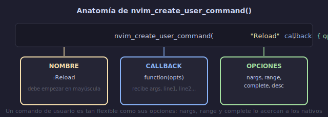

# 🛠️ Comandos de Usuario y Funciones Lua

## 🎯 Objetivos

- Crear comandos personalizados con `nvim_create_user_command`
- Escribir funciones Lua reutilizables para extender Neovim
- Crear módulos de utilidad (`lua/util/`)
- Definir comandos con argumentos, rango y completado

---

## 📋 Contenido

### 1. Comandos de Usuario

Permiten crear nuevos comandos `:` como si fueran nativos de Vim.



```lua
vim.api.nvim_create_user_command({nombre}, {callback}, {opciones})
--                                  ↑          ↑           ↑
--                              ":MiComando"  función    args, rango...
```

**Ejemplo básico**:

```lua
-- :Reload → recargar configuración
vim.api.nvim_create_user_command("Reload", function()
  vim.cmd("source " .. vim.fn.stdpath("config") .. "/init.lua")
  vim.notify("Configuración recargada", vim.log.levels.INFO)
end, { desc = "Recargar configuración de Neovim" })
```

---

### 2. Comandos con Argumentos

```lua
-- :Greet Ana → "Hola, Ana!"
vim.api.nvim_create_user_command("Greet", function(opts)
  vim.notify("Hola, " .. opts.args .. "!", vim.log.levels.INFO)
end, {
  desc = "Saludar a alguien",
  nargs = 1,              -- exactamente 1 argumento
  -- nargs = "*"          -- 0 o más
  -- nargs = "?"          -- 0 o 1
  -- nargs = "+"          -- 1 o más
})
```

**Tipos de nargs**:
```text
nargs = 0    → sin argumentos
nargs = 1    → exactamente 1
nargs = "*"  → 0 o más
nargs = "?"  → 0 o 1
nargs = "+"  → 1 o más
```

---

### 3. Comandos con Rango

```lua
-- :Sort → ordena líneas en el rango (como :sort nativo)
vim.api.nvim_create_user_command("SortLines", function(opts)
  local start = opts.line1
  local finish = opts.line2
  local lines = vim.api.nvim_buf_get_lines(0, start - 1, finish, false)
  table.sort(lines)
  vim.api.nvim_buf_set_lines(0, start - 1, finish, false, lines)
end, {
  desc = "Ordenar líneas seleccionadas",
  range = true,          -- acepta rango: :5,10SortLines
})
```

```text
Uso:
:SortLines              → ordena todo el archivo (rango implícito)
:5,20SortLines          → ordena líneas 5-20
V seleccionas + :SortLines → ordena selección visual
```

---

### 4. Comandos con Completado

```lua
-- :Palette → cambiar tema con autocompletado
vim.api.nvim_create_user_command("Palette", function(opts)
  vim.cmd("colorscheme " .. opts.args)
  vim.notify("Tema: " .. opts.args)
end, {
  desc = "Cambiar tema de color",
  nargs = 1,
  complete = function(arg_lead, cmdline, cursor_pos)
    -- arg_lead = texto escrito hasta ahora
    -- Devuelve lista de sugerencias que empiezan con arg_lead
    return vim.tbl_filter(function(name)
      return name:find(arg_lead) ~= nil
    end, vim.fn.getcompletion("", "color"))
  end,
})

-- :Palette tokyo<Tab> → autocompleta a "tokyonight"
```

**Tipos de completado predefinidos**:
```lua
complete = "file"        → nombres de archivo
complete = "dir"         → directorios
complete = "color"       → esquemas de color
complete = "command"     → comandos de Vim
complete = "buffer"      → buffers abiertos
complete = "help"        → temas de ayuda
complete = "mapping"     → mappings
complete = "filetype"    → tipos de archivo
complete = "function"    → funciones
```

---

### 5. Funciones Lua para Neovim

Organiza funciones reutilizables en módulos:

```lua
-- lua/util/init.lua
local M = {}

-- Obtener la ruta del directorio del proyecto (raíz git)
function M.get_project_root()
  local git_root = vim.fn.systemlist("git rev-parse --show-toplevel 2>/dev/null")
  if #git_root > 0 and git_root[1] ~= "" then
    return git_root[1]
  end
  return vim.fn.getcwd()
end

-- Abrir archivo en split vertical con telescope o netrw
function M.open_file_split(filepath)
  vim.cmd("vsplit " .. filepath)
end

-- Mostrar tiempo de inicio (útil para depuración)
function M.show_startup_time()
  local stats = require("lazy").stats()
  local ms = math.floor(stats.startuptime * 1000 + 0.5)
  vim.notify("Neovim iniciado en " .. ms .. " ms con " .. stats.loaded .. "/" .. stats.count .. " plugins")
end

-- Buscar TODOs en el proyecto
function M.find_todos()
  vim.cmd("Telescope live_grep default_text=TODO")
  -- O sin telescope:
  -- vim.cmd("vimgrep /TODO/gj **/*.lua")
  -- vim.cmd("copen")
end

-- Recargar configuración
function M.reload_config()
  vim.cmd("source " .. vim.fn.stdpath("config") .. "/init.lua")
  vim.notify("Configuración recargada ✓")
end

return M
```

**Uso en otros archivos**:
```lua
local util = require("util")

-- En un keymap:
vim.keymap.set("n", "<leader>pr", function()
  local root = util.get_project_root()
  vim.notify("Raíz del proyecto: " .. root)
end, { desc = "Mostrar raíz del proyecto" })

-- En un comando:
vim.api.nvim_create_user_command("Root", function()
  vim.notify(util.get_project_root())
end, { desc = "Mostrar raíz del proyecto" })
```

---

### 6. Funciones para Plugins

```lua
-- lua/util/lsp.lua
local M = {}

-- Configurar keymaps LSP al conectar
function M.on_attach(client, bufnr)
  local opts = { buffer = bufnr, desc = "LSP" }

  vim.keymap.set("n", "gd", vim.lsp.buf.definition, vim.tbl_extend("force", opts, { desc = "Ir a definición" }))
  vim.keymap.set("n", "gr", vim.lsp.buf.references, vim.tbl_extend("force", opts, { desc = "Referencias" }))
  vim.keymap.set("n", "K", vim.lsp.buf.hover, vim.tbl_extend("force", opts, { desc = "Documentación" }))
  vim.keymap.set("n", "<leader>rn", vim.lsp.buf.rename, vim.tbl_extend("force", opts, { desc = "Renombrar" }))
  vim.keymap.set("n", "<leader>ca", vim.lsp.buf.code_action, vim.tbl_extend("force", opts, { desc = "Code action" }))
  vim.keymap.set("n", "[d", vim.diagnostic.goto_prev, vim.tbl_extend("force", opts, { desc = "Diagnóstico anterior" }))
  vim.keymap.set("n", "]d", vim.diagnostic.goto_next, vim.tbl_extend("force", opts, { desc = "Diagnóstico siguiente" }))
end

return M
```

---

### 7. Recetas de Comandos Útiles

```lua
-- :Todo → buscar TODOs con telescope
vim.api.nvim_create_user_command("Todo", function()
  vim.cmd("Telescope live_grep default_text=TODO")
end, { desc = "Buscar TODOs en el proyecto" })

-- :Lines → contar líneas de código
vim.api.nvim_create_user_command("Lines", function()
  local count = vim.api.nvim_buf_line_count(0)
  vim.notify("Líneas: " .. count)
end, { desc = "Contar líneas del buffer" })

-- :Sh → ejecutar comando shell y mostrar salida en split
vim.api.nvim_create_user_command("Sh", function(opts)
  vim.cmd("new")
  vim.cmd("terminal " .. opts.args)
end, { desc = "Ejecutar shell en split", nargs = "+" })

-- :SudoWrite → guardar con sudo (para archivos de sistema)
vim.api.nvim_create_user_command("SudoWrite", function()
  vim.cmd("w !sudo tee % > /dev/null")
  vim.cmd("edit!")  -- recargar
  vim.notify("Guardado con sudo")
end, { desc = "Guardar archivo con sudo" })
```

---

## 💡 Resumen

```text
┌─────────────────────────────────────────────────────────┐
│ COMANDOS DE USUARIO                                      │
│                                                          │
│ vim.api.nvim_create_user_command("Nombre", fn, {        │
│   desc = "Descripción",                                  │
│   nargs = "?",      -- 0, 1, *, ?, +                    │
│   range = true,     -- acepta :5,10Comando              │
│   complete = "file" -- autocompletado                   │
│ })                                                       │
│                                                          │
│ MÓDULOS DE UTILIDAD:                                     │
│   lua/util/init.lua → funciones reutilizables           │
│   require("util").funcion()                             │
└─────────────────────────────────────────────────────────┘
```

---

## ✅ Checklist de Verificación

- [ ] Creé al menos 3 comandos de usuario
- [ ] Al menos 1 comando acepta argumentos
- [ ] Al menos 1 comando acepta rango
- [ ] Tengo un módulo `lua/util/init.lua` con funciones útiles
- [ ] Mis funciones son reutilizables (no hardcodean valores)

---

## 🎮 Ejercicio Rápido

```text
1. Crea comando :Reload que recargue tu configuración
2. Crea comando :Lines que muestre líneas del buffer actual
3. Crea módulo util/ con función get_project_root()
4. Crea keymap <leader>pr que muestre proyecto actual (usando util/)
5. Crea comando :Wc [archivo] que cuente palabras (wc -w)
```

---

## ➡️ Siguiente

[05 - Vimscript para Legacy](05-vimscript-legacy.md)
