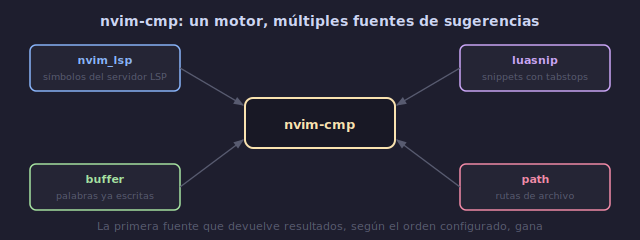

# 💡 Autocompletado con nvim-cmp

## 🎯 Objetivos

- Configurar nvim-cmp como motor de autocompletado
- Conectar múltiples fuentes: LSP, buffer, path, snippets
- Personalizar la apariencia del menú de completado
- Configurar mappings para navegar y aceptar sugerencias

---

## 📋 Contenido

### 1. ¿Qué es nvim-cmp?

nvim-cmp es el motor de autocompletado para Neovim. Es extensible: puedes conectar múltiples "fuentes" que proveen sugerencias.



```text
┌──────────────────────────────────────┐
│ nvim-cmp (motor)                     │
│                                      │
│ Fuentes:                             │
│  cmp-nvim-lsp   ← LSP (inteligente) │
│  cmp-buffer      ← palabras en buffer│
│  cmp-path        ← rutas de archivo  │
│  cmp_luasnip     ← snippets          │
│  cmp-cmdline     ← comandos Vim      │
│  cmp-git         ← commits, issues   │
└──────────────────────────────────────┘
```

---

### 2. Instalación

```lua
-- lua/plugins/lsp.lua
{
  "hrsh7th/nvim-cmp",
  event = "InsertEnter",
  dependencies = {
    "hrsh7th/cmp-nvim-lsp",     -- fuente LSP
    "hrsh7th/cmp-buffer",       -- palabras del buffer
    "hrsh7th/cmp-path",         -- rutas de archivos
    "hrsh7th/cmp-cmdline",      -- comandos en :
    "L3MON4D3/LuaSnip",         -- motor de snippets
    "saadparwaiz1/cmp_luasnip", -- fuente de snippets para cmp
  },
  config = function()
    local cmp = require("cmp")
    local luasnip = require("luasnip")

    cmp.setup({
      snippet = {
        expand = function(args)
          luasnip.lsp_expand(args.body)
        end,
      },

      -- Mappings del menú de completado
      mapping = cmp.mapping.preset.insert({
        ["<C-b>"] = cmp.mapping.scroll_docs(-4),
        ["<C-f>"] = cmp.mapping.scroll_docs(4),
        ["<C-Space>"] = cmp.mapping.complete(),
        ["<C-e>"] = cmp.mapping.abort(),
        ["<CR>"] = cmp.mapping.confirm({ select = true }),
        ["<Tab>"] = cmp.mapping.select_next_item(),
        ["<S-Tab>"] = cmp.mapping.select_prev_item(),
      }),

      -- Fuentes de sugerencias
      sources = cmp.config.sources({
        { name = "nvim_lsp" },   -- LSP primero (más inteligente)
        { name = "luasnip" },    -- snippets
        { name = "buffer" },     -- palabras del buffer
        { name = "path" },       -- rutas de archivos
      }),
    })

    -- Autocompletado en línea de comandos
    cmp.setup.cmdline(":", {
      mapping = cmp.mapping.preset.cmdline(),
      sources = cmp.config.sources({
        { name = "cmdline" },
      }, {
        { name = "path" },
      }),
    })

    -- Autocompletado en búsqueda /
    cmp.setup.cmdline("/", {
      mapping = cmp.mapping.preset.cmdline(),
      sources = {
        { name = "buffer" },
      },
    })
  end,
}
```

---

### 3. Fuentes de Completado

| Fuente | Plugin | Qué sugiere |
|--------|--------|------------|
| `nvim_lsp` | cmp-nvim-lsp | Símbolos del language server |
| `buffer` | cmp-buffer | Palabras ya escritas en buffers |
| `path` | cmp-path | Rutas de archivos/directorios |
| `luasnip` | cmp_luasnip | Snippets definidos |
| `cmdline` | cmp-cmdline | Comandos de Vim (para `:`) |
| `nvim_lua` | cmp-nvim-lua | API de Neovim (vim.*) |
| `git` | cmp-git | Commits, issues, GitHub |

**Prioridad**: las fuentes se evalúan en orden. La primera que devuelve resultados gana.

---

### 4. Personalizar Apariencia

```lua
cmp.setup({
  -- Ventana de completado
  window = {
    completion = cmp.config.window.bordered({
      border = "rounded",
      winhighlight = "Normal:Pmenu,FloatBorder:Pmenu,CursorLine:PmenuSel",
    }),
    documentation = cmp.config.window.bordered({
      border = "rounded",
    }),
  },

  -- Formateo de ítems (íconos, fuente)
  formatting = {
    fields = { "kind", "abbr", "menu" },
    format = function(entry, vim_item)
      -- Íconos para tipos de completado
      local kind_icons = {
        Text = "󰉿", Method = "󰆧", Function = "󰊕", Constructor = "",
        Field = "󰜢", Variable = "󰀫", Class = "󰠱", Interface = "",
        Module = "", Property = "󰜢", Unit = "󰑭", Value = "󰎠",
        Enum = "", Keyword = "󰌋", Snippet = "", Color = "󰏘",
        File = "󰈙", Reference = "󰈇", Folder = "󰉋", EnumMember = "",
        Constant = "󰏿", Struct = "󰙅", Event = "", Operator = "󰆕",
        TypeParameter = "󰗴",
      }
      vim_item.kind = string.format("%s %s", kind_icons[vim_item.kind] or "", vim_item.kind)
      vim_item.menu = ({
        nvim_lsp = "[LSP]",
        luasnip = "[Snip]",
        buffer = "[Buf]",
        path = "[Path]",
      })[entry.source.name] or "[?]"
      return vim_item
    end,
  },
})
```

---

### 5. Navegación en el Menú

```text
Ctrl-Space   → abrir menú de completado
Ctrl-n/p     → siguiente/anterior ítem (default)
Tab / S-Tab  → siguiente/anterior (con mapping)
Ctrl-f/b     → scroll documentación abajo/arriba
Ctrl-e       → cerrar menú
Enter        → aceptar selección
```

---

### 6. Configuración por Tipo de Archivo

```lua
-- Más fuentes para archivos específicos
cmp.setup.filetype("markdown", {
  sources = cmp.config.sources({
    { name = "path" },
    { name = "buffer" },
  }, {
    { name = "nvim_lsp" },  -- baja prioridad en markdown
  }),
})

-- Autocompletado de paths para comandos como :e, :w
cmp.setup.cmdline({ "/", "?" }, {
  mapping = cmp.mapping.preset.cmdline(),
  sources = {
    { name = "buffer" },
  },
})
```

---

### 7. Tips de Completado

```lua
-- Activar autocompletado automático (sin Ctrl-Space)
cmp.setup({
  completion = {
    autocomplete = {
      cmp.TriggerEvent.TextChanged,
      cmp.TriggerEvent.InsertEnter,
    },
    completeopt = "menu,menuone,noinsert,noselect",
  },
})
```

```text
completeopt:
menu         → mostrar menú
menuone      → mostrar menú aunque haya 1 opción
noinsert     → no insertar automáticamente
noselect     → no seleccionar automáticamente (requiere Tab/Enter)
preview      → mostrar ventana de preview
```

---

## 💡 Resumen

```text
┌─────────────────────────────────────────────────────────┐
│ NVIM-CMP                                                 │
│                                                           │
│ MOTOR: nvim-cmp (InsertEnter)                            │
│                                                           │
│ FUENTES:                                                  │
│   nvim_lsp → sugerencias del language server            │
│   luasnip  → snippets                                    │
│   buffer   → palabras del archivo                       │
│   path     → rutas de archivos                          │
│                                                           │
│ NAVEGACIÓN:                                               │
│   Tab/S-Tab → siguiente/anterior                        │
│   Ctrl-Space → abrir menú                                │
│   Enter     → aceptar                                    │
│   Ctrl-e    → cancelar                                   │
└─────────────────────────────────────────────────────────┘
```

---

## ✅ Checklist de Verificación

- [ ] nvim-cmp instalado y funcionando
- [ ] 4 fuentes configuradas: nvim_lsp, luasnip, buffer, path
- [ ] Íconos visibles en el menú de completado
- [ ] Tab/S-Tab navegan el menú
- [ ] Autocompletado en línea de comandos (:) funciona
- [ ] Ventana de documentación aparece al seleccionar

---

## 🎮 Ejercicio Rápido

```text
1. Abre un archivo Lua
2. Escribe: vim.key
3. Ctrl-Space → debe mostrar sugerencias del LSP
4. Escribe: "hola" en una línea, luego en otra escribe: ho
5. Ctrl-Space → debe sugerir "hola" (fuente buffer)
6. Escribe: require("
7. Ctrl-Space → debe sugerir paths (fuente path)
```

---

## ➡️ Siguiente

[03 - Treesitter](03-treesitter.md)
