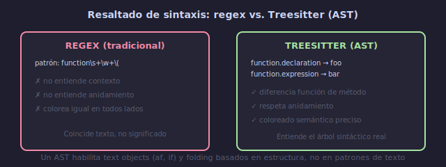

# 🌳 Treesitter: Resaltado y Text Objects Avanzados

## 🎯 Objetivos

- Entender la diferencia entre regex highlighting y Treesitter
- Instalar parsers de Treesitter para tus lenguajes
- Usar text objects basados en AST (función, clase, loop)
- Configurar folding estructural con Treesitter

---

## 📋 Contenido

### 1. Regex vs Treesitter



```text
Regex highlighting (tradicional):
  ┌─────────────────────────────────┐
  │ Patrón: `function\s+\w+\(`     │
  │ Coincide con strings de texto   │
  │ ❌ No entiende contexto          │
  │ ❌ No entiende anidamiento       │
  │ ❌ Colorea igual en todos lados  │
  └─────────────────────────────────┘

Treesitter:
  ┌─────────────────────────────────┐
  │ Genera un AST (árbol sintáctico)│
  │ Entiende que es cada token      │
  │ ✅ Diferencia función de método  │
  │ ✅ Respeta anidamiento           │
  │ ✅ Coloreado semántico preciso   │
  └─────────────────────────────────┘
```

**Ejemplo visual**:
```javascript
// Con regex: todo "function" se ve igual
function foo() { ... }
const bar = function() { ... }

// Con Treesitter: entiende que:
// - foo es function.declaration
// - bar es variable + function.expression
// Puede colorearlos diferente
```

---

### 2. Instalación

```lua
-- lua/plugins/lsp.lua
{
  "nvim-treesitter/nvim-treesitter",
  build = ":TSUpdate",
  event = "VeryLazy",
  config = function()
    require("nvim-treesitter.configs").setup({
      -- Parsers a instalar
      ensure_installed = {
        "lua", "python", "javascript", "typescript",
        "bash", "json", "yaml", "toml", "markdown",
        "css", "html", "regex", "vim", "vimdoc",
        "c", "cpp", "rust", "go",
      },

      -- Resaltado
      highlight = {
        enable = true,
        additional_vim_regex_highlighting = false,
      },

      -- Indentación basada en árbol
      indent = {
        enable = true,
      },

      -- Folding
      fold = {
        enable = true,
      },

      -- Incremental selection
      incremental_selection = {
        enable = true,
        keymaps = {
          init_selection = "gnn",
          node_incremental = "grn",
          scope_incremental = "grc",
          node_decremental = "grm",
        },
      },
    })
  end,
}
```

---

### 3. Text Objects con Treesitter

```lua
-- lua/plugins/editing.lua
{
  "nvim-treesitter/nvim-treesitter-textobjects",
  dependencies = { "nvim-treesitter/nvim-treesitter" },
  event = "VeryLazy",
  config = function()
    require("nvim-treesitter.configs").setup({
      textobjects = {
        select = {
          enable = true,
          lookahead = true,
          keymaps = {
            -- Text objects para código
            ["af"] = "@function.outer",   -- a function
            ["if"] = "@function.inner",   -- inner function
            ["ac"] = "@class.outer",      -- a class
            ["ic"] = "@class.inner",      -- inner class
            ["al"] = "@loop.outer",       -- a loop
            ["il"] = "@loop.inner",       -- inner loop
            ["aa"] = "@parameter.outer",  -- a argument
            ["ia"] = "@parameter.inner",  -- inner argument
          },
        },
        move = {
          enable = true,
          set_jumps = true,
          goto_next_start = {
            ["]f"] = "@function.outer",   -- siguiente función
            ["]c"] = "@class.outer",      -- siguiente clase
          },
          goto_previous_start = {
            ["[f"] = "@function.outer",   -- función anterior
            ["[c"] = "@class.outer",      -- clase anterior
          },
        },
        swap = {
          enable = true,
          swap_next = {
            ["<leader>sa"] = "@parameter.inner",  -- swap argumento
          },
          swap_previous = {
            ["<leader>sA"] = "@parameter.inner",
          },
        },
      },
    })
  end,
}
```

**Uso de text objects Treesitter**:
```text
daf  → delete a function (eliminar función completa)
cif  → change inner function (cambiar cuerpo de función)
vaf  → seleccionar función completa
dal  → delete a loop
]f   → ir a siguiente función
[f   → ir a función anterior
```

---

### 4. Comandos Treesitter

```text
:TSInstall {lang}    → instalar parser para un lenguaje
:TSUpdate            → actualizar todos los parsers
:TSUninstall {lang}  → desinstalar parser
:TSModuleInfo        → ver estado de módulos
:TSEditQuery         → editar queries de Treesitter
:InspectTree         → ver el AST del archivo actual (debug)
```

**Explorar el AST**:
```text
:InspectTree
→ abre ventana lateral mostrando el árbol sintáctico
→ navega el código y ve cómo Treesitter lo entiende
→ útil para depurar queries y entender la estructura
```

---

### 5. Playground (Análisis Visual)

```lua
{
  "nvim-treesitter/playground",
  dependencies = { "nvim-treesitter/nvim-treesitter" },
  cmd = "TSPlaygroundToggle",
  keys = { { "<leader>tp", "<cmd>TSPlaygroundToggle<CR>", desc = "Treesitter Playground" } },
}
```

---

### 6. Folding con Treesitter

```lua
-- Opciones de folding
vim.opt.foldmethod = "expr"
vim.opt.foldexpr = "nvim_treesitter#foldexpr()"
vim.opt.foldenable = false    -- no colapsar al abrir
vim.opt.foldlevel = 99        -- mostrar todo expandido

-- Keymaps de folding
vim.keymap.set("n", "za", "za", { desc = "Toggle fold" })
vim.keymap.set("n", "zA", "zA", { desc = "Toggle fold recursivo" })
vim.keymap.set("n", "zR", "zR", { desc = "Expandir todos" })
vim.keymap.set("n", "zM", "zM", { desc = "Colapsar todos" })
```

---

### 7. Refinamiento de Resaltado

```lua
-- Overrides de colores para grupos específicos
vim.api.nvim_set_hl(0, "@function.builtin", { fg = "#89b4fa", bold = true })
vim.api.nvim_set_hl(0, "@variable.member", { fg = "#cdd6f4" })
vim.api.nvim_set_hl(0, "@comment", { fg = "#6c7086", italic = true })

-- También puedes desactivar módulos para un lenguaje específico:
{
  highlight = {
    enable = true,
    disable = { "latex" },  -- no usar TS para LaTeX
  },
}
```

---

## 💡 Resumen

```text
┌─────────────────────────────────────────────────────────┐
│ TREESITTER                                                │
│                                                           │
│ INSTALAR:                                                 │
│   :TSInstall {lang} → instalar parser                   │
│   ensure_installed → en configuración                   │
│                                                           │
│ CARACTERÍSTICAS:                                          │
│   highlight → resaltado semántico                        │
│   indent → indentación inteligente                       │
│   fold → folding estructural                             │
│   textobjects → af, if, ac, ic, al, il                  │
│   move → ]f, [f (navegar funciones)                     │
│   incremental_selection → gnn, grn, grc, grm            │
│                                                           │
│ DEBUG:                                                    │
│   :InspectTree → ver el AST en tiempo real               │
│   TSPlayground → experimentar con queries                │
└─────────────────────────────────────────────────────────┘
```

---

## ✅ Checklist de Verificación

- [ ] Treesitter instalado con parsers para mis lenguajes
- [ ] Resaltado semántico activo (se nota la diferencia)
- [ ] Text objects: `daf`, `cif`, `vaf` funcionan
- [ ] Navegación: `]f` / `[f` entre funciones
- [ ] Folding estructural con `za`, `zR`, `zM`
- [ ] :InspectTree muestra el AST correctamente

---

## 🎮 Ejercicio Rápido

```text
1. :InspectTree → abre el árbol sintáctico
2. Navega el código → mira cómo cambia el AST
3. daf sobre una función → elimina toda la función
4. vif → selecciona el cuerpo de la función
5. ]f → salta a la siguiente función
6. gnn → inicia selección incremental
7. grn → expande selección al nodo padre
```

---

## ➡️ Siguiente

[04 - Debugging con nvim-dap](04-dap-debugging.md)
