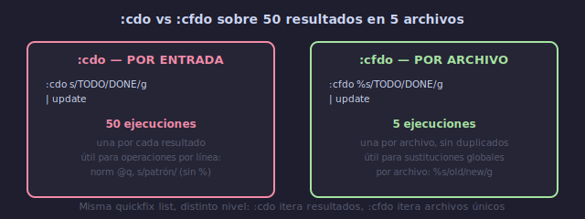

# 🔄 Búsqueda y Reemplazo Avanzados Multiarchivo

## 🎯 Objetivos

- Dominar búsquedas con regex avanzadas en Vim
- Usar `:cdo` y `:cfdo` para operaciones masivas
- Combinar quickfix, arglist y macros para refactorizaciones
- Aplicar el flujo completo: buscar → analizar → reemplazar → verificar

---

## 📋 Contenido

### 1. Regex Avanzado en Vim

```text
Patrones útiles para búsqueda:

\v            → very magic (regex más natural)
\V            → very nomagic (texto literal)

Anclas:
\< ... \>     → palabra completa
^             → inicio de línea
$             → final de línea

Grupos:
(...)         → grupo de captura (con \v)
\(...\)       → grupo de captura (sin \v)
\1, \2 ...    → referencias a grupos en reemplazo

Cuantificadores:
*             → 0 o más
\+            → 1 o más
=             → 0 o 1
{n,m}         → entre n y m

Clases:
\d            → dígito
\D            → no dígito
\w            → palabra (letra, dígito, _)
\W            → no palabra
\s            → espacio en blanco
\S            → no espacio
```

**Ejemplos con very magic (`\v`)**:
```text
:%s/\v(foo|bar)/reemplazo/g      → foo o bar
:%s/\v(\d{4})-(\d{2})-(\d{2})/\3\/\2\/\1/g → reordenar fecha
:'<,'>s/\v^\s+//                  → eliminar indentación en selección
```

---

### 2. `:cdo` y `:cfdo` — Operaciones sobre Quickfix



```text
:cdo {cmd}       → ejecutar en cada entrada de quickfix
:cfdo {cmd}      → ejecutar en cada ARCHIVO de quickfix (sin duplicados)

Diferencia:
:vimgrep /TODO/gj **/*.lua
→ 50 resultados en 5 archivos

:cdo s/TODO/DONE/g | update     → 50 ejecuciones (una por resultado)
:cfdo %s/TODO/DONE/g | update   → 5 ejecuciones (una por archivo)
```

**Cuándo usar cada uno**:
```text
:cfdo → sustituciones globales por archivo (%s)
:cdo  → operaciones por línea (norm @q, s/patrón//, etc.)
```

---

### 3. Sustitución con Confirmación

```text
:%s/old/new/gc         → confirmar cada reemplazo
:argdo %s/old/new/gc | update → batch con confirmación

Opciones de confirmación:
y → sí (yes)
n → no
a → todas (all — aplicar resto sin preguntar)
q → salir (quit)
l → última (last — aplicar esta y salir)
```

---

### 4. Flujo de Refactorización Completo

**Escenario**: Renombrar `user_name` a `username` en un proyecto Python con 30 archivos.

```text
Paso 1 — AUDITAR (encontrar):
:vimgrep /\<user_name\>/gj **/*.py
→ 87 resultados en 12 archivos

Paso 2 — ANALIZAR:
:copen
→ revisar visualmente los resultados
→ identificar falsos positivos (ej: comentarios)

Paso 3 — CREAR MACRO PARA CASOS ESPECIALES:
/self.user_name
q n
ciw self.username Esc
n @n
q
→ macro recursiva para casos específicos

Paso 4 — SUSTITUIR:
:cfdo %s/\<user_name\>/username/gc | update
→ confirmar cada archivo

Paso 5 — VERIFICAR:
:vimgrep /\<user_name\>/gj **/*.py
→ debe dar 0 resultados

Paso 6 — COMMIT:
:Gcommit -m "refactor: rename user_name → username"
```

---

### 5. Refactorización con Macros + Quickfix

```text
Escenario: Añadir type hints a funciones Python.

1. Encontrar definiciones de función sin type hints:
   :vimgrep /def \w+(self):/gj **/*.py
   :copen

2. Crear macro para añadir -> None:
   q t
   /def Enter
   f :
   i -> None Esc
   q

3. Aplicar macro a cada resultado:
   :cdo norm @t | update
```

---

### 6. Técnicas de Reemplazo Condicional

```text
Sustituir solo en líneas que NO son comentarios:
:g/^[^#]/s/old/new/g           → líneas que no empiezan con #

Sustituir solo en strings:
:%s/"\([^"]*\)old\([^"]*\)"/"\1new\2"/g

Sustituir con condición en el reemplazo:
:%s/\v(\d+)/\=submatch(1) > 10 ? 'grande' : submatch(1)/g
→ si el número > 10, reemplaza por "grande"
```

---

### 7. Búsqueda y Reemplazo con `:g` y `:v`

```text
:g/patrón/s/old/new/g      → sustituye solo en líneas con patrón
:v/patrón/s/old/new/g      → sustituye en líneas SIN patrón

:g/^import/norm I#         → comenta líneas de import
:g/^\s*$/d                  → elimina líneas vacías
:v/function/d               → elimina líneas que NO contienen function
```

**Ejemplo: limpiar imports no usados**:
```text
1. :vimgrep /import/gj src/**/*.js
2. :cfdo g/^import.*unused$/d | update
   → en cada archivo, elimina imports marcados como unused
```

---

### 8. Buscar y Reemplazar entre Marcas

```text
:'a,'b s/old/new/g          → entre marcas a y b
:'<,'> s/old/new/g          → en selección visual

:.,$ s/old/new/g            → desde aquí hasta el final
:1,. s/old/new/g            → desde inicio hasta aquí
```

---

## 💡 Resumen

```text
┌─────────────────────────────────────────────────────────┐
│ REFACTORIZACIÓN AVANZADA                                  │
│                                                           │
│ FLUJO:                                                    │
│   1. :vimgrep /old/gj **/*.ext  → encontrar              │
│   2. :copen                     → analizar               │
│   3. :cfdo %s/old/new/gc | update → reemplazar           │
│   4. :vimgrep /old/gj           → verificar              │
│                                                           │
│ TÉCNICAS:                                                 │
│   :cdo norm @q              → macro por resultado        │
│   :cfdo %s/old/new/g | update → sustitución por archivo  │
│   :g/regex/s/old/new/g      → sustitución condicional    │
│   /gc                        → confirmación              │
│   \v(pattern)                → very magic regex           │
└─────────────────────────────────────────────────────────┘
```

---

## ✅ Checklist de Verificación

- [ ] Uso `:cfdo` para sustituciones por archivo
- [ ] Uso `:cdo` para operaciones por línea
- [ ] Uso `/gc` para confirmación en batch
- [ ] Verifico cambios con segundo `:vimgrep`
- [ ] Combino `:g` con `:s` para sustituciones condicionales

---

## 🎮 Ejercicio Rápido

```text
En este proyecto (bootcamp):

1. :vimgrep /NUEVO/gj **/*.md
   → cuenta cuántas veces aparece "NUEVO"
   → (es parte del marcador de contenido nuevo)

2. :copen → revisa los resultados

3. :cfdo %s/NUEVO/COMPLETADO/g | update
   (no ejecutes, solo entiende el comando)

4. Verificar: :vimgrep /NUEVO/gj **/*.md
```

---

## ➡️ Siguiente

[05 - Fugitive Avanzado y Workflows](05-fugitive-avanzado.md)
