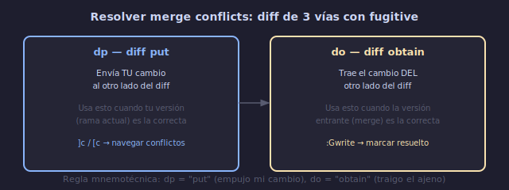

# 🔀 Fugitive Avanzado y Workflows de Proyecto

## 🎯 Objetivos

- Dominar operaciones git avanzadas con vim-fugitive
- Resolver merge conflicts desde Vim
- Editar archivos remotos con netrw scp://
- Integrar Vim en flujos completos de desarrollo

---

## 📋 Contenido

### 1. Fugitive: Más Allá del Status

Fugitive es mucho más que `:Git`. Es un wrapper completo de git con filosofía Vim.

**Navegar el historial**:
```text
:Glog                   → historial de commits del archivo actual
:Glog --                → historial de commits de todo el repo
:Glog -10               → últimos 10 commits

En la ventana de :Glog:
Enter sobre un commit   → ver el commit completo
o                       → abrir commit en split
```

**Explorar el repo**:
```text
:Gedit HEAD:./%         → ver versión commiteada del archivo actual
:Gedit HEAD~3:./%        → ver versión de hace 3 commits
:Gedit origin/main:./%  → ver versión en otra rama

:Gdiffsplit HEAD~1      → diff con el commit anterior
:Gvdiffsplit HEAD~1     → diff vertical
```

**Blame interactivo**:
```text
:Gblame                 → blame del archivo actual
Enter sobre un commit   → ver ese commit completo
o                       → abrir commit en split
-                       → reblame desde el commit padre
p                       → reblame desde el commit anterior
```

---

### 2. Merge Conflicts con Fugitive



```text
Durante un merge conflictivo:

:Gstatus                → muestra archivos en conflicto
Enter sobre archivo     → abre el archivo
:Gdiffsplit             → muestra diff de 3 vías

En la ventana de diff:
]c / [c                 → siguiente/anterior conflicto
dp                      → diff put (tomar cambios de este lado)
do                      → diff obtain (tomar cambios del otro lado)

Para marcar como resuelto:
:Gwrite                 → stage el archivo
```

**Flujo de merge conflict**:
```text
1. :Git merge feature-branch
2. :Gstatus → ves archivos con conflictos
3. Enter sobre conflicto → abrir archivo
4. :Gdiffsplit → ver diff 3 vías
5. ]c para navegar conflictos
6. dp o do para elegir cambios
7. :Gwrite → marcar resuelto
8. :Git merge --continue
```

---

### 3. Navegación de Commits

```text
:Git log                → log estándar en ventana Vim
:Git log --oneline      → log compacto

:0Glog                  → log de TODO el repo (no solo archivo actual)
```

**En la ventana de log/quickfix de git**:
```text
Enter   → ver commit completo
o       → abrir en split
O       → abrir en pestaña
S       → abrir en split vertical
X       → cherry-pick
C       → checkout el commit (modo detached HEAD)
```

---

### 4. Flujo de Trabajo Git con Vim

```text
Ciclo completo de un feature:

1. CREAR BRANCH:
   :Git checkout -b feature/nueva-funcion

2. DESARROLLAR:
   (editas código normalmente)
   → gitsigns muestra cambios en gutter
   → ]h / [h navega hunks

3. REVISAR CAMBIOS:
   :Gstatus
   → '-' en archivos para stagear
   → '=' en archivos para ver diff

4. COMMIT:
   :Gcommit
   → escribe mensaje en buffer
   → :wq para confirmar

5. REVISAR HISTORIAL:
   :Glog
   → ver commits recientes

6. PUSH:
   :Git push origin feature/nueva-funcion

7. VOLVER A MAIN:
   :Git checkout main
   :Git pull
```

---

### 5. Edición Remota con netrw

Vim puede editar archivos en servidores remotos via SSH/SCP:

```text
vim scp://user@host//ruta/absoluta/archivo
vim scp://user@host/~/ruta/relativa/archivo
vim ftp://user@host/ruta/archivo
```

```bash
# Abrir archivo remoto
nvim scp://deploy@servidor.com//var/www/config.php

# Editar como si fuera local
# :w → guarda remotamente via scp
```

**Configuración**:
```lua
-- Usar ssh config (~/.ssh/config)
vim.g.netrw_ssh_cmd = "ssh"
vim.g.netrw_scp_cmd = "scp -q"
```

---

### 6. Workflow: Revisión de Código

```text
1. FETCH PR:
   :Git fetch origin pull/123/head:pr-123
   :Git checkout pr-123

2. EXPLORAR CAMBIOS:
   :Gdiffsplit main
   → ver diff con la rama principal
   ]c / [c → navegar cambios

3. DEJAR COMENTARIOS:
   En el diff:
   o → abrir versión en split
   Editar → añadir comentario (// REVIEW: ...)
   :w

4. VER CAMBIOS DEL PR:
   :Glog main..pr-123
   → lista de commits en el PR
```

---

### 7. Integración con Telescope y Which-key

```lua
-- Mappings cohesivos para el flujo git
vim.keymap.set("n", "<leader>gs", "<cmd>Git<CR>", { desc = "Git status" })
vim.keymap.set("n", "<leader>gc", "<cmd>Gcommit<CR>", { desc = "Git commit" })
vim.keymap.set("n", "<leader>gp", "<cmd>Git push<CR>", { desc = "Git push" })
vim.keymap.set("n", "<leader>gl", "<cmd>Glog<CR>", { desc = "Git log" })
vim.keymap.set("n", "<leader>gb", "<cmd>Gblame<CR>", { desc = "Git blame" })
vim.keymap.set("n", "<leader>gd", "<cmd>Gdiffsplit<CR>", { desc = "Git diff" })

-- Telescope git
vim.keymap.set("n", "<leader>gf", "<cmd>Telescope git_files<CR>", { desc = "Git files" })
vim.keymap.set("n", "<leader>gC", "<cmd>Telescope git_commits<CR>", { desc = "Git commits" })
vim.keymap.set("n", "<leader>gB", "<cmd>Telescope git_branches<CR>", { desc = "Git branches" })
```

---

### 8. Workflow: Restaurar Versiones Anteriores

```text
1. Ver historial del archivo:
   :Glog

2. Encontrar el commit deseado:
   Enter → ver commit completo

3. Restaurar versión:
   :Gedit {commit_hash}:%
   → abre la versión antigua en buffer

4. Copiar lo necesario:
   yank → volver al archivo actual → pegar

   O restaurar completo:
   :Gread {commit_hash}
   → reemplaza buffer actual con versión del commit
```

---

## 💡 Resumen

```text
┌─────────────────────────────────────────────────────────┐
│ FUGITIVE AVANZADO                                        │
│                                                           │
│ HISTORIAL:                                                │
│   :Glog / :Glog --      → commits (archivo / repo)      │
│   :Gblame                → blame interactivo            │
│   :Gedit {ref}:./%       → ver versión específica        │
│                                                           │
│ DIFF:                                                     │
│   :Gdiffsplit {ref}      → diff con referencia          │
│   ]c / [c                → navegar cambios               │
│                                                           │
│ MERGE:                                                    │
│   :Gdiffsplit            → 3-way diff                    │
│   dp / do                → elegir cambios                │
│   :Gwrite                → marcar resuelto               │
│                                                           │
│ REMOTO:                                                   │
│   nvim scp://user@host/ruta → editar archivo remoto      │
└─────────────────────────────────────────────────────────┘
```

---

## ✅ Checklist de Verificación

- [ ] Uso `:Glog` para explorar historial de commits
- [ ] Uso `:Gblame` para blame interactivo
- [ ] Resuelvo merge conflicts con `dp` / `do` en fugitive
- [ ] Uso `:Gdiffsplit` para comparar versiones
- [ ] Integro git en mi flujo con keymaps cohesivos

---

## 🎮 Ejercicio Rápido

```text
1. En un repo git:
   :Glog → explora commits recientes
   Enter sobre uno → ve el commit

2. :Gblame → blame interactivo
   Enter sobre línea → ve quién la cambió

3. :Gdiffsplit HEAD~1 → diff con commit anterior
   ]c / [c → navegar cambios

4. :Gstatus → status interactivo
   - → stage/unstage
   = → ver diff inline
```

---

## ➡️ Continuar

[📖 Volver al README de la Semana](../README.md) • [💻 Ir a Prácticas](../2-practicas/README.md)
