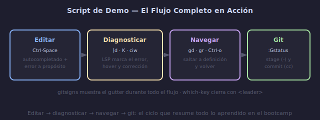

# 🎬 Demo: Flujo de Trabajo Completo

## 🎯 Objetivos

- Tener un script preparado para tu demostración en vivo
- Practicar un flujo completo: editar → diagnosticar → navegar → git
- Mostrar todas las features clave de tu configuración

---

## 📋 Contenido

### 1. Script de Demo (Ejemplo Guiado)

Usa este script como base. Adáptalo a tu configuración y lenguaje favorito.



```text
═══════════════════════════════════════════════════════════
DEMO: Configuración de Neovim — [Tu Nombre]
Duración: 3-5 minutos
═══════════════════════════════════════════════════════════

[ABRIR NEOVIM]
nvim ~/proyecto-demo/src/main.[ext]

"Bienvenidos. Esta es mi configuración de Neovim que desarrollé
durante el bootcamp. Como pueden ver, tengo un tema oscuro,
barra de estado con la rama git, y números relativos."


[NAVEGACIÓN DE ARCHIVOS] — 30s
<leader>ff
# buscar: "config"
# abrir archivo de configuración

"Uso telescope como fuzzy finder. Puedo buscar archivos por
nombre, texto, buffers abiertos y más, todo sin ratón."

<leader>fb
# mostrar buffers abiertos


[EXPLORADOR DE ARCHIVOS] — 20s
<leader>e
# abrir neo-tree
# navegar estructura de directorios

"También tengo un explorador de archivos lateral. Puedo crear,
renombrar y eliminar archivos sin salir de Vim."


[EDICIÓN Y AUTOCOMPLETADO] — 45s
# Volver al archivo main
# Escribir una función incompleta

function pro

# Ctrl-Space → mostrar menú de autocompletado
"El autocompletado viene de 4 fuentes: el language server,
palabras del buffer, rutas de archivos y snippets."

# Seleccionar sugerencia con Tab
# Completar la función con un error a propósito:

function process(data):
    return data.upper()  # ERROR: upper no existe, es upper()

"Pueden ver que el LSP detecta errores en tiempo real.
El diagnóstico aparece como texto virtual y en el gutter."


[DIAGNÓSTICO Y CORRECCIÓN] — 45s
[d
# navegar al error
"Con ]d y [d navego entre errores."

K
# hover sobre upper()
"K muestra documentación. Veo que el método correcto es upper."

ciw upper Esc
# corregir el error

"El error desaparece inmediatamente."


[NAVEGACIÓN DE CÓDIGO] — 30s
# Cursor sobre una función del proyecto
gd
# saltar a definición

"gd me lleva a la definición de cualquier símbolo."

Ctrl-o
# volver

"Ctrl-o me trae de vuelta."

gr
# mostrar referencias
"gr muestra todas las referencias en el proyecto con telescope."


[REFACTORIZACIÓN] — 30s
<leader>rn
# renombrar variable process → process_data
"Con LSP rename, cambio el nombre en todos los archivos
donde se usa, de forma segura y automática."


[FORMATEO Y COMENTARIOS] — 20s
# Seleccionar bloque
V j j
=
"= autoindenta el código seleccionado."

gcc
# comentar línea
"gcc comenta y descomenta líneas. Funciona en cualquier lenguaje."
gcc
# descomentar


[GIT] — 30s
# Mostrar cambios en gutter
"Hice algunos cambios. Gitsigns me muestra en el gutter
qué líneas modifiqué, añadí o eliminé."

:Gstatus
# ver status de git
"Con :Gstatus tengo un panel interactivo de git. Puedo ver
los cambios, hacer stage con '-' y commit con 'cc'."


[BÚSQUEDA EN PROYECTO] — 20s
<leader>fg
# buscar: process
"Telescope live_grep busca texto en tiempo real en todo
el proyecto. Más rápido que grep tradicional."


[WHICH-KEY] — 15s
<leader>
# esperar 500ms
"Which-key me recuerda todos los atajos disponibles
organizados por categoría. Ya no necesito memorizarlos."


[CIERRE] — 20s
"Esta configuración está disponible en GitHub:"
[mostrar URL del repo]

"Incluye instrucciones de instalación, screenshots y
documentación de cada plugin y keymap. ¡Gracias!"
```

---

### 2. Archivos de Práctica para la Demo

Prepara estos archivos antes de la demo para no improvisar:

```bash
mkdir -p ~/proyecto-demo/src

# Python (ejemplo)
cat > ~/proyecto-demo/src/main.py << 'EOF'
"""Módulo principal del proyecto demo."""

class Calculadora:
    """Calculadora con operaciones básicas."""

    def __init__(self):
        self.historial = []

    def sumar(self, a: int, b: int) -> int:
        """Suma dos números."""
        resultado = a + b
        self.historial.append(f"{a} + {b} = {resultado}")
        return resultado

    def restar(self, a: int, b: int) -> int:
        """Resta dos números."""
        resultado = a - b
        self.historial.append(f"{a} - {b} = {resultado}")
        return resultado


def calcular_total(items):
    """Calcula el total de una lista de items."""
    total = 0
    for item in items:
        total += item.precio * item.cantidad
    return total


class Item:
    def __init__(self, nombre, precio, cantidad):
        self.nombre = nombre
        self.precio = precio
        self.cantidad = cantidad


# TODO: implementar descuentos
# TODO: añadir soporte para impuestos

if __name__ == "__main__":
    calc = Calculadora()
    print(calc.sumar(10, 5))
    print(calc.restar(20, 8))
EOF
```

---

### 3. Antes de la Demo: Checklist

```text
☐ Probar que todos los plugins cargan sin errores
☐ Verificar :LspInfo muestra servidores conectados
☐ Verificar que los keymaps no tienen conflictos
☐ Tener archivos de demo listos con "errores" intencionales
☐ Tener terminal lista (limpia, tamaño adecuado)
☐ Tener el repo de GitHub abierto en navegador (por si acaso)
☐ Cerrar notificaciones del sistema
☐ Silenciar el teléfono
```

---

### 4. Durante la Demo

```text
✓ Respira. Habla despacio. No hay prisa.
✓ Narra lo que haces y por qué lo haces
✓ Si algo falla, sigue adelante
✓ Muestra entusiasmo — tú construiste esto
✓ Termina con tu repo de GitHub
✓ Pregunta si hay dudas
```

---

## ➡️ Siguiente

[05 - Comunidad y Próximos Pasos](05-comunidad-y-recursos-finales.md)
